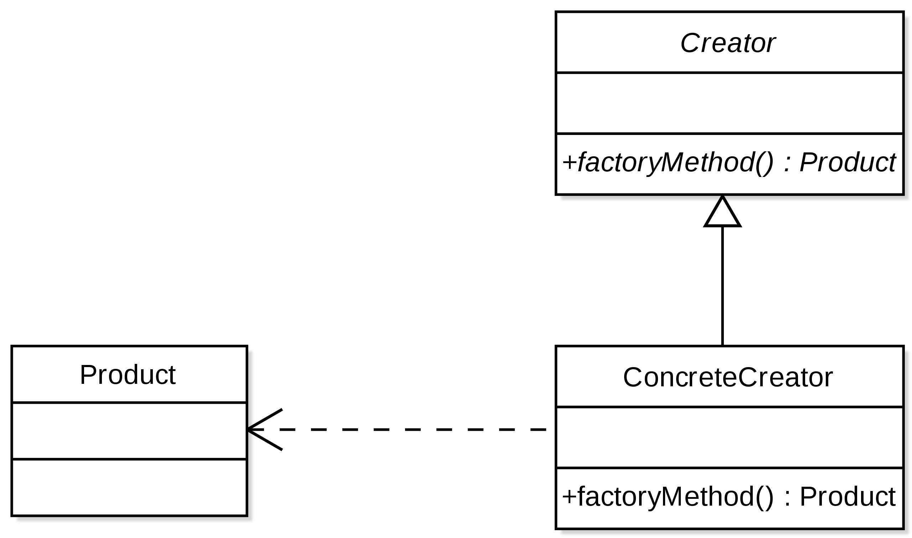
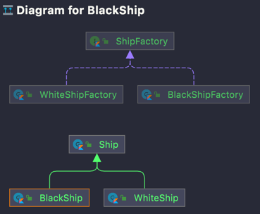

# 02. 팩토리 메소드 패턴 (Factory method) 패턴

## 학습 목표
- 팩토리 메소드 패턴으로 **해결하려는 문제**는 무엇인가?
   - 어떤 객체를 생성하는 책임을 구체적인(Concrete) 클래스가 아니라 추상적인 인터페이스에 정의한다.
- 팩토리 메소드 패턴을 사용하는 이유는 무엇인가?
   - if..else 구문으로 나뉘는 객체 생성 코드를 각각의 팩토리로 정의하고, 변경에 닫혀있고 확장에 열려 있는 코드를 작성한다.

### 팩토리 패턴을 적용한 ship 객체 생성 구조

### 변경에는 닫혀있고, 확장에는 열려있다.
확장을 하려면 기존 코드가 계속해서 변경되어야 하는 문제가 있다. 기존 코드에 변경이 없으면서 확장 가능한 코드를 작성하기 위해 팩토리 패턴 사용한다.

### 팩토리 메소드 패턴을 사용헀을 때의 장점과 단점
- **장점** : 객체 생성을 하나의 인터페이스로 관리할 수 있다. 객체 유형이 추가될 때마다 코드 변경이 발생하지 않는다.
  - **기존 코드를 건드리지 않고** 같은 종류의 새로운 인스턴스를 다른 방법으로 **확장 가능**하다.
  - 느슨한 결합(인터페이스 구조)을 이용해 확장에 용이한 구조
- **단점** : 객체가 많아질수록 팩토리가 개수가 많아져 관리하기 어렵다. 단순한 팩토리는 팩토리 패턴을 적용하는 게 비효율일 수도 있다.
  - 클래스가 늘어나는 단점은 피할 수 없다.

### 확장에 열려있고 변경에 닫혀있는 객체지향원칙 (Open-Closed principle)
- 공통된 코드는 변경되지 않게끔 추출해 변경하지 않도록 하고, 새로운 기능을 추가할 수 있다.
  - `whiteship` 생성부를 건드리지 않고 `blackship`을 추가했다.

### 자바 8에 추가된 default 메소드
- 자바 8부터 인터페이스에 default 메소드(함수 구현)를 정의할 수 있다.
  - 이전에는 추상 클래스나 중간 class에 공용 메소드를 구현해야 했다. 
  - 추상클래스에서 하던 일을 인터페이스가 대신 할 수 있기 때문에 추상클래스를 많이 사용하지 않는다.
  - 자바 9부터는 인터페이스에 private 메소드를 정의할 수 있다.

### 팩토리 메소드 패턴 실무 적용
- 단순 팩토리 패턴
  - 매개변수의 값에 따라 또는 메소드에 따라 각기 다른 인스턴스를 리턴하는 단순한 버전의 팩토리 패턴
  - java.lang.Calendar 또는 java.lang.NumberFormat
- Spring BeanFactory
  - Object 타입의 Product를 만드는 BeanFactory라는 creator

---

# 과제
- 마이데이터 콜렉터 팩토리를 구현한다.
- 마이데이터에는 `은행`, `카드`, `보험` 세 종류의 업권이 있으며, 업권별 데이터를 수집하기 위해서는 개별 콜렉터가 필요하다.
   - 은행 : 은행 콜렉터
   - 카드 : 카드 콜렉터
   - 보험 : 보험 콜렉터
- 콜렉터 기능
   - 콜렉터는 데이터 수집 기능을 갖는다.
   - 데이터가 수집될 때마다 로그를 적재한다.
- 콜렉터 생성 시 공용 전처리
   - 금결원으로부터 전달받은 인증키 등록
   - 담당자 등록 (최대 2인)
