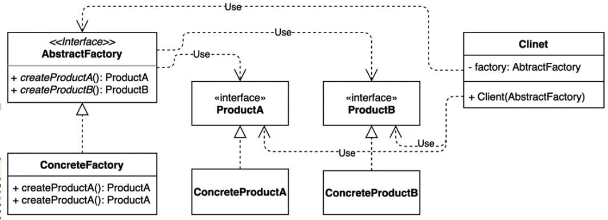

# 추상 팩토리(Abstract facotry) 패턴

**서로 관련있는 여러 객체를 만들어주는 인터페이스**
구체적으로 어떤 클래스의 인스턴스 ( concrete product) 를 사용하는지 감출 수 있다 

## 팩토리 메소드 패턴 vs 추상 팩토리 패턴
비슷한 개념이지만 관점이 다름!

### 팩토리 메소드 패턴
- 팩토리를 구현하는 방법에 초점을 둔다
- concrete 타입의 인스턴스를 인터페이스로 숨기는데 집중 
- 구체적인 객체 생성 과정을 하위 클래스로 옮기는 것이 목적 ( inherite )

### 추상 팩토리 패턴
- 팩토리를 사용하는 방법에 초첨을 둔다
- client 관점에서 추상화된 인터페이스에만 접근할 수 있도록 제공
- 관련있는 여러 객체를 구체적인 클래스에 의존하지 않고 만들 수 있게 해주는 것이 목적 ( composition )

## 추상 팩토리 패턴을 사용했을때의 장점과 단점
- 팩토리 메소드 패턴과 동일

## 추가 설명 

팩토리 패턴의 종류와 설명

- method 로 객체를 만들어 주는 패턴 자체를 `팩토리 패턴`이라고 부름 
```
class Factory { fun create(): Proeuct }
```

- 입력 값을 받아서 값에 따른 객체를 만들어 주는것을 `심플 팩토리`라고 부름 ( open closed 원칙 위배 )
```
class Factory { 
    fun create(type: String): Product {
        if(type == A) return ProductA()
        if(type == B) return ProductB()
    }
}
```

- 반환하는 객체 종류에 따른 subClass 로 팩토리를 분리하는 것을 `팩토리 메소드`라고 부름 ( open closed 원칙 만죡 )
```
interface Factroy{
    fun create()
}

class FactoryA : Factory {
    override fun create() = ProuctA()
}

class FatoryB : Factory {
    override fun create() = ProductB()
}
```

- 반환하는 객체 구성에 사용되는 객체를 주입받아서 추상화 시키는 것을 `추상 팩토리`라고 부름 ( 비슷한 군집의 개체 생성 가능 )

```

interface Part()

class Part1 : Part
class Part2 : Part


interface Factory {
    fun create(part : Part)
}

class FactoryA : Factory {
    override fun create(part : Part) = ProductA(part)
}

```


# 과제
- 자동차 팩토리를 구현한다

- 자동차 종류는 현대 / 기아가 있어 각 회사마다 자동차 팩토리가 필요하다
    - 현대 : 핸대자동차팩토리
    - 기아 : 기아자동차 팩토리

- 자동차에는 휠 / 천장 옵션이 있다. 팩토리에서 자동차를 생산할 때 휠 / 천장 옵션을 제공받아 자동차를 생산한다

- 휠 옵션에는 일반휠/ 고급휠이 있다.
- 천장은 일반천장/ 썬루프천장이 있다.
