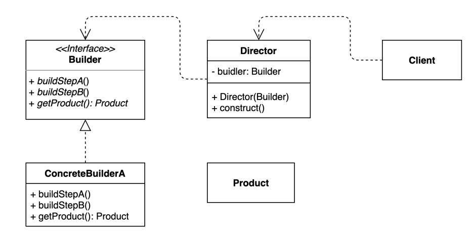
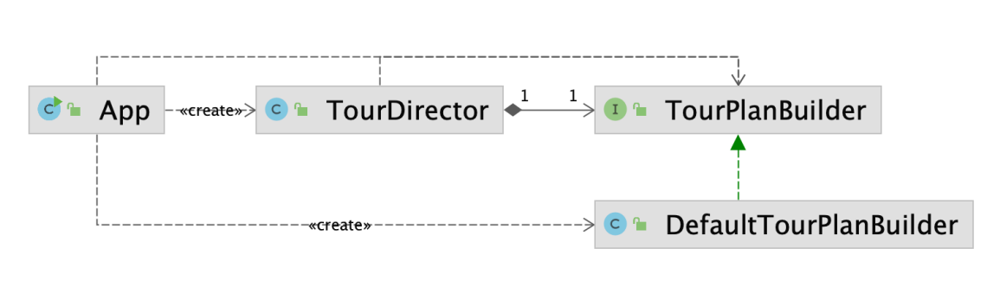

# Builder 패턴
- 인스턴스를 생성 하는 방법과 관련 있는 패턴
- 동일한 프로세스를 거쳐 다양한 구성의 인스턴스를 만드는 방법
- 복잡한 객체를 만드는 프로세스를 독립적으로 분리할 수 있다

## 빌더 패턴 적용 전
```kotlin
val tourPlan = TourPlan()
    tourPlan.title = "제주도 여행"
    tourPlan.nights = 2
    tourPlan.days = 3
    tourPlan.startDate = LocalDate.of(2021, 12, 23)
    tourPlan.whereToStay = "롯데 리조트"
    tourPlan.detailPlan = listOf(
        DetailPlan(0, "렌트카 대여"),
        DetailPlan(0, "갈치 먹기"),
        DetailPlan(0, "갈치 돈카츠 먹기"),
        DetailPlan(0, "리조트 가기")
)
```

- `Java`에서는 `Setter`를 이용해 값을 할당하는 방식이 많은데, 해당 방식은 2개의 값을 항상 같이 셋팅해야 하는 조건이 있는 경우
  해당 부분을 적용하기가 힘듬
- `nights`, `days`는 항상 데이터가 같이 있거나 없어야 하는데, 개발한 사람은 해당 내용을 알아도 다른 사람은 모를 수 있는 문제가 발생 

```kotlin
// 장기 여행
    constructor(title: String, nights: Int, days: Int, startDate: LocalDate, whereToStay: String, detailPlan: DetailPlan) {
        ...    
    }
    // 당일 치기 여행
    constructor(title: String, startDate: LocalDate, detailPlan: DetailPlan) {
        ...
    }
```
- `Setter`를 제거하고 생성자만 사용하면 해당 문제가 해결될까?
- 생성자를 이용한 방식으로 한 경우 어떤 생성자를 사용해야 하는지도 알기 어려운 문제가 있음

## 빌더 패턴 사용 후

```kotlin
interface TourPlanBuilder {
    fun title(title: String): TourPlanBuilder
    fun nightsAndDays(nights: Int,days: Int): TourPlanBuilder
    fun startDate(startDate: LocalDate): TourPlanBuilder
    fun whereToStay(whereToStay: String): TourPlanBuilder
    fun addPlan(day: Int, plan: String): TourPlanBuilder
    fun getPlan(): TourPlan
}
```
- 값을 셋팅해야 하는 메소드를 만들고, 반환 값은 자기 자신으로 지정하여 체인형태로 구현 가능하게 설정
- 최종 값을 만들어야 하는 메소드만 자기 자신이 아닌 최종 클래스 값으로 셋팅
- `fun getPlan(): TourPlan` 처럼 최종 값 반환을 할 때 validation을 넣어서 최종 값이 정상적인 상태로 만들어졌는지 확인하기 좋음

```kotlin
data class DefaultTourBuilder(
    var title: String = "",
    var nights: Int = 0,
    var days: Int = 0,
    var startDate: LocalDate = LocalDate.now(),
    var whereToStay: String = "",
    var detailPlans: MutableList<DetailPlan> = mutableListOf(),
) : TourPlanBuilder {

    override fun title(title: String): TourPlanBuilder {
        this.title = title
        return this
    }

    override fun nightsAndDays(nights: Int, days: Int): TourPlanBuilder {
        this.nights = nights
        this.days = days
        return this
    }

    override fun startDate(startDate: LocalDate): TourPlanBuilder {
        this.startDate = startDate
        return this
    }

    override fun whereToStay(whereToStay: String): TourPlanBuilder {
        this.whereToStay = whereToStay
        return this
    }

    override fun addPlan(day: Int, plan: String): TourPlanBuilder {
        this.detailPlans.add(DetailPlan(day, plan))
        return this
    }

    override fun getPlan(): TourPlan {
        return TourPlan(
            title = title,
            nights = nights,
            days = days,
            startDate = startDate,
            whereToStay = whereToStay,
            detailPlans = detailPlans
        )
    }
}
```
- `interface`를 상속받은 defaultBuilder class를 만들고 값을 할당해줄 때 값을 저장할 프로퍼티 변수 값을 같이 만들어 준다
- 보통 프로퍼티 변수 값을 갖고 있는 방식으로 구현

```kotlin
val defaultTourBuilder = DefaultTourBuilder()
    val cancunTrip1 = defaultTourBuilder.title("칸쿤 여행")
        .nightsAndDays(2, 3)
        .startDate(LocalDate.of(2020, 12, 9))
        .whereToStay("리조트")
        .addPlan(0, "체크인하고 짐 풀기")
        .addPlan(0, "저녁식사")
        .getPlan()
```
- builder 패턴을 이용해서 인스턴스를 만들면 필요한 값에 대해서 method 방식으로 변경할 수 있고, 같이 저장되어야 하는 값에 대해서도 한번에 받을 수 있게 수정하여
실수를 방지할 수 있음
- 마지막 getPlan에서 validation까지 적용한다면 좀 더 안전한 코딩 방식이 가능


```kotlin
class TourDirector(
  private val tourPlanBuilder: TourPlanBuilder,
) {

  fun cancunTrip(): TourPlan =
    tourPlanBuilder.title("칸쿤 여행")
      .nightsAndDays(2, 3)
      .startDate(LocalDate.of(2020, 12, 9))
      .whereToStay("리조트")
      .addPlan(0, "체크인하고 짐 풀기")
      .addPlan(0, "저녁식사")
      .getPlan()

  fun longBeachTrip(): TourPlan =
    tourPlanBuilder.title("칸쿤 여행")
      .nightsAndDays(2, 3)
      .startDate(LocalDate.of(2020, 12, 9))
      .whereToStay("리조트")
      .addPlan(0, "체크인하고 짐 풀기")
      .addPlan(0, "저녁식사")
      .getPlan()
}

// 최종
val tourDirector = TourDirector(DefaultTourBuilder())
val cancunTrip = tourDirector.cancunTrip()
val longBeachTrip = tourDirector.longBeachTrip()
```
- 자주 사용되는 인스턴스가 있다면 Director를 만들어서 고정적인 값으로 만들어서 제공하는 방식도 가능

## 장점 & 단점
### 장점
- 인스턴스를 만들 때 복잡한 순서로 만들어야 하는 경우 순서를 강제해서 사용자가 실수를 줄일 수 있음
- 입력 받은 값을 검증하는 부분을 추가해서 필요한 시기에 검증하는 방법도 가능
- 만드는 과정에 대해서 숨겨놓아서 불필요한 부분을 노출하지 않을 수 있는 장점(?)이 있음
- Director를 이용해서 만들면 정해진 프로세스는 같지만 builder에 의해서 추상화된 인스턴스를 만들 수 있음
- `getPlan` 처럼 인스턴스를 만드는 작업 작업이 존재하기 때문에 미완성된 인스턴스를 사용하지 않아 실수를 줄이는 장점
### 단점
- Director와 Builder를 만들어야 하는 번거로움이 있음
- 원하는 객체를 만들려면 빌더부터 만들어야 한다.
- 구조가 복잡해 진다. (트레이드 오프)

## 자바와 스프링에서 찾아보는 패턴
- StringBuilder
```kotlin
fun main() {
    val builder = StringBuilder()
    val sample1 = builder.append("aaa").append("aaa").toString()

    val sample2 = buildString {
        append("aaa")
        append("aaa")
    }

    println(sample1 == sample2)
}
```
- StreamBuilder
```kotlin
fun main() {
    val names: Stream<String> = Stream.builder<String>().add("abc").add("bcd").build()

    names.forEach {
        println(it)
    }
}
```
- Lombok
  - java에 builder annotation 사용
  - builder를 사용했을 때 intellij 필드 변경을 이용했을 때 같이 바뀌지 않는 단점..
- Spring Web - UriComponents
```kotlin
fun main() {
    val uriComponents: UriComponents = UriComponentsBuilder.newInstance()
        .scheme("https")
        .host("toss.im")
        .path("login")
        .build()

    println(uriComponents)
}
```
- MockMvcWebClientBuilder
# 과제
- 빌더의 순서를 지정해서 만들어보기
- 검증 부분도 추가
