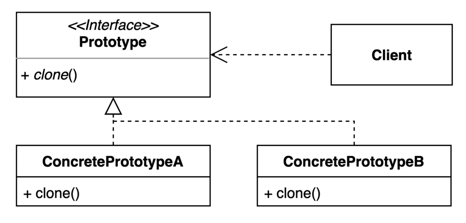
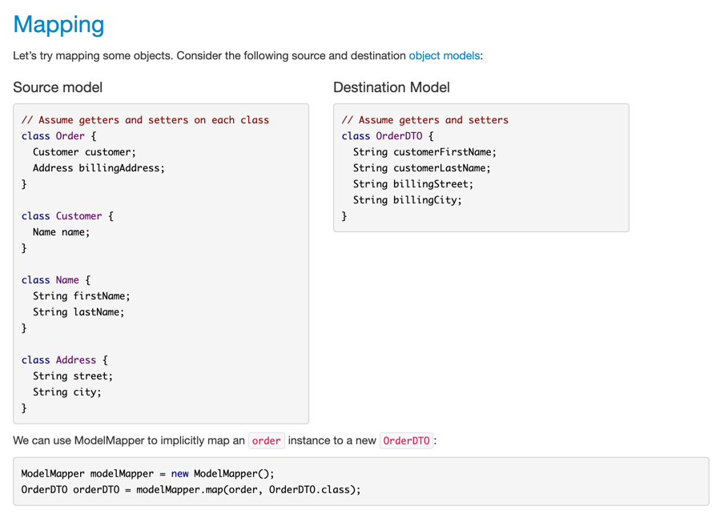

# Prototype 패턴
- 기존의 인스턴스를 프로토타입으로 하여 새로운 인스턴스를 만드는 방법
- 복제 기능을 갖추고 있는 기존 인스턴스를 프로토타입으로 사용해 새 인스턴스를 만들 수 있다

## Prototype 만드는 법
자바 기준 clonable interface를 구현해야하지만, 코틀린의 경우 data class라면 copy를 이용해 손쉽게 protoType 패턴을 사용할 수 있다. 

~~~kotlin
data class Animal(
    private val name: String,
    private val age: Int,
    private val species: String,
    private val hospital: Hospital,
)

data class Hospital(
    private val name: String,
    private val phoneNumber: String,
)

fun main() {
    val seogongHospital = Hospital("서공동물병원", "123-4567")
    val momo = Animal("모모", 6, getSpecies(), seogongHospital)
    val mumu = Animal("무무", 6, getSpecies(), seogongHospital)

    // getSpecies()가 오래 걸리므로 시간이 오래 걸린다
}

private fun getSpecies(): String {
    // takes long time
    return "고양이"
}
~~~
단순히 이름만 변경하여 새로운 인스턴스를 얻고 싶은데 `getSpecies()`를 한번더 호출하게 되면 시간이 많이 소요된다. 

~~~kotlin
fun main() {
    val seogongHospital = Hospital("서공동물병원", "123-4567")
    val momo = Animal("모모", 6, getSpecies(), seogongHospital)
    val mumu = momo.copy(name = "무무")
    // swallow copy
    assert(momo.hospital == mumu.hospital)
}

private fun getSpecies(): String {
    // takes long time
    return "고양이"
}
~~~
copy를 이용하여 이름만 변경할 수 있다. 이때 이 copy는 swallow copy로 hospital 객체는 momo와 mumu가 공유하게 된다. 

~~~kotlin
data class DeepCopyAnimal(
    private val name: String,
    private val age: Int,
    private val species: String,
    val hospital: Hospital,
) {

    fun deepCopy(name: String): DeepCopyAnimal {
        val copiedHospital = Hospital(hospital.name, hospital.phoneNumber)
        return DeepCopyAnimal(name, age, species, copiedHospital)
    }
}

fun main() {
    val seogongHospital = Hospital("서공동물병원", "123-4567")
    val momo = DeepCopyAnimal("모모", 6, getSpecies(), seogongHospital)
    val mumu = momo.deepCopy("무무")
    // deep copy
    assert(momo.hospital != mumu.hospital)
}
~~~

deep copy를 사용하고 싶다면 위처럼 구현을 해야한다. 

## Prototype의 장점 

- 복잡한 객체를 만드는 과정을 숨길 수 있다
- 기존 객체를 복제하는 과정이 새 인스턴스를 만드는 것보다 비용(시간 또는 메모리)적인면에서 효율적일 수도 있다
- 추상적인 타입을 리턴할 수 있다

## Prototype의 단점
- 복제한 객체를 만드는 과정 자체가 복잡할 수 있다 (특히, 순환참조가 있는 경우)

## 실무에서 사용하는 방법
List는 Clonable을 상속하지 않는다. (ArrayList가 직접적으로 상속을 하고 있음)
그래서 Collection을 복사할땐 다른 방법을 사용한다. 그중 하나가 생성자를 사용하는 방법이다. 

### 방법 1. 생성자를 사용하는 방법 
엄밀히 말하면 prototype을 그대로 사용하는 것은 아니다. 
~~~kotlin
// 이 또한 shallow copy 이다. 
fun main() {
    val hospital = Hospital("병원1", "phoneNumber1")
    val animalList = listOf(
        Animal("animal1", 1, "species1", hospital),
        Animal("animal2", 2, "species2", hospital),
        Animal("animal3", 3, "species3", hospital),
        Animal("animal4", 4, "species4", hospital),
        Animal("animal5", 5, "species5", hospital),
        Animal("animal6", 6, "species6", hospital),
    )

    val copiedList = listOf(animalList)

    assert(copiedList != animalList)
    assert((copiedList[0] as? Animal)?.hospital == (animalList[0]).hospital)
}
~~~

### 방법 2. ModelMapper
Reflection을 이용한 방법
~~~kotlin
val animal = Animal("animal1", 1, "species1", hospital)
val mapper = ModelMapper()

val copiedAnimal = mapper.map(animal, Animal::class.java)

assert(copiedAnimal.name == animal.name)
assert(copiedAnimal.age == animal.age)
assert(copiedAnimal.species == animal.species)
assert(copiedAnimal.hospital == animal.hospital)
~~~

#### ModelMapper

