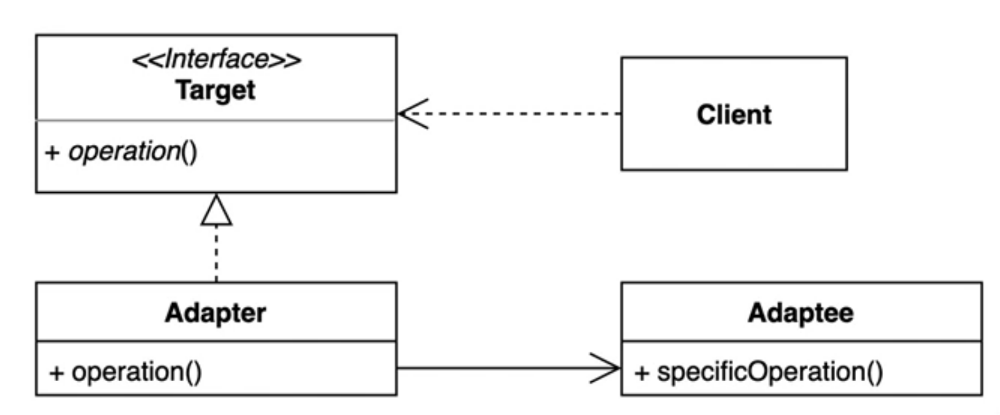
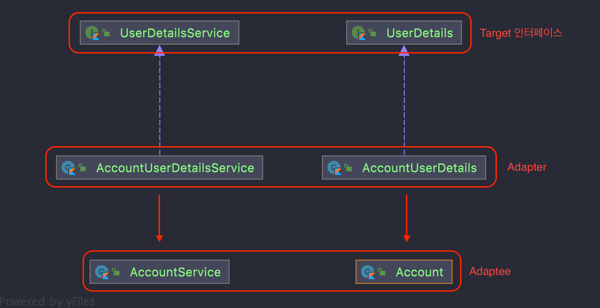

# 06. 어댑터 패턴 (Adapter Pattern)
- 기존 코드를 클라이언트가 사용하는 인터페이스의 구현체로 바꿔주는 패턴
  - 110V <=> 220V 코드의 호환을 위해 사용하는 어댑터(돼지코)
  - 클라이언트가 사용하는 인터페이스를 **따르지 않는 기존 코드를 재사용** 할 수 있게 해준다. (상호호환)



- Targer : 클라이언트가 원하는 인터페이스
- Adapter : 기존 코드(Adaptee)를 클라이언트가 원하는 인터페이스(Target)와 호환될 수 있도록 변환해주는 인터페이스
- Adaptee : 기존 코드

## 코드 적용


```kotlin
// Client
fun login(userName: String, password: String): String {
   val userDetails: UserDetails = userDetailsService.loadUser(userName)
   return if (userDetails.getPassword() == password) userDetails.getUserName()
      else throw IllegalArgumentException()
}
```

```kotlin
// Target
interface UserDetails {
  fun getUserName(): String
  fun getPassword(): String
}

interface UserDetailsService {
  fun loadUser(userName: String): UserDetails
}
```

```kotlin
// Adapter
class AccountUserDetails(
   private val account: Account
) : UserDetails {
   override fun getUserName(): String = account.userName
   override fun getPassword(): String = account.password
}

class AccountUserDetailsService(
   private val accountService: AccountService
) : UserDetailsService {
   override fun loadUser(userName: String): UserDetails {
      val account: Account = accountService.findAccountByUserName(userName)
      return AccountUserDetails(account)
   }
}
```

```kotlin
// Adaptee
class Account(
  val userName: String,
  val password: String,
  val email: String
)

class AccountService {
  fun findAccountByUserName(userName: String): Account =
    Account(userName)

  fun createNewAccount(account: Account) {
    // TODO("Not implemented")
  }

  fun updateAccount(account: Account) {
    // TODO("Not implemented")
  }
}
```

## 장점 & 단점
### 장점
- 기존 코드를 변경하지 않고 원하는 인터페이스 구현체를 만들어 **재사용** 할 수 있다. (`Open Closed 원칙`)
- 기존 코드가 하던 일(`단일 책임 원칙`)과 특정 인터페이스 구현체로 변환하는 작업을 각기 다른 클래스로 분리하여 관리할 수 있다.

### 단점
- 새 클래스가 생겨 복잡도가 증가할 수 있다.
- 경우에 따라서 기존 코드가 해당 인터페이스를 구현하도록 수정하는 것이 좋은 선택이 될 수 있다.
- 대안으로 Adaptee에 해당하는 코드를 직접 수정할 수 있다면, 클래스를 늘리지 않고도 실용적으로 어댑터 패턴 적용 가능하다.

## 자바와 스프링에서 찾아보는 패턴
### 자바
- java.util.Arrays#asList(T...)
- java.util.Collections#list(Enumeration), java.util.Collections#enumeration()
```java
List<String> strings = Arrays.asList("a", "b", "c");
// Enumeration : Target 인터페이스
// Collections.enumeration : 어댑터
// string : 어댑티
Enumeration<String> enumeration = Collections.enumeration(strings);
ArrayList<String> list = Collections.list(enumeration);
```
- java.io.InputStreamReader(InputStream)
- java.io.OutputStreamWriter(OutputStream)
```java
// 문자열 => InputStream
// InputStream => InputStreamReader
// InputStreamReader => BufferedReader
try {
   InputStream is = new FileInputStream("input.txt");
   InputStreamReader isr = new InputStreamReader(is);
   BufferedReader reader = new BufferedReader(isr);
   while(reader.ready()) {
      System.out.println(reader.readLine());
   }
} catch (IOException e) {
   throw new RuntimeException(e);
}
```

### 스프링
- HandlerAdapter 인터페이스 : 다양한 형태의 핸들러 코드를 스프링 MVC가 실행할 수 있는 형태로 변환해주는 어댑터용 인터페이스
```java
public interface HandlerAdapter {
    ...
	@Nullable
	ModelAndView handle(HttpServletRequest request, HttpServletResponse response, Object handler) throws Exception;
	...
```

## 과제
- 결제 단말기 간의 호환을 위한 어댑터를 만들어야 한다.
  - 단말 A : 토스 단말
  - 단말 B : 카카오 단말
- 토스 가맹점은 토스 단말밖에 없는데, 강성 유저가 카카오 단말로 결제를 요구함. 토스 단말과 카카오 단말 호환을 위한 어댑터를 만들어보자!
- 참고로 결제는 토스뱅크 카드만 받는다.
