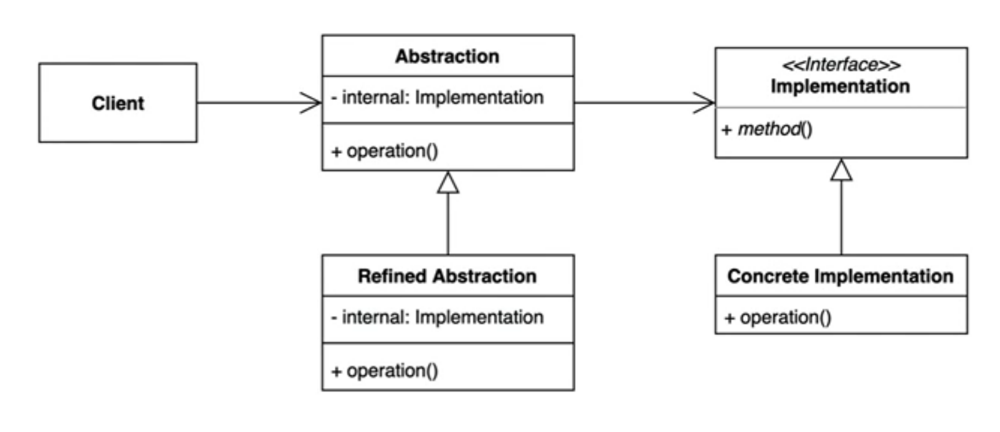

# 07. 브릿지 패턴 (Bridge Pattern)

추상적인(abstract) 것과 구체적인(concrete) 것을 분리하여 연결하는 패턴



- 하나의 계층구조일 때보다 각기 나누었을 때 독립적인 계층 구조로 발전시킬 수 있다
- Abstrcation / Refined Abstraction 은 추상적인 부분을, Implementation / Concrete Implementation 은 구체적인 부분을 확장
- 어댑터 패턴과의 차이점 : 구체적인 구현을 숨기는 부분은 동일하나, 어댑터는 서로 다른 구현을 맞춰주는  역할


---

## 코드 적용 

```kotlin
// Clinent
fun main() {
    val 기본스킨 = DefaultSkin()
    val 정복자스킨 = 정복자()

    val 아리 = 아리(기본스킨)
    val 정복자아리 = 아리(정복자스킨)

    아리.move()
    정복자아리.move()
}

```

```kotlin
// Abstraction
open class DefaultChampion(val name: String, val skin: Skin) : com.example.gofdesignpattern.week07_bridge.`01_패턴_적용_전`.Champion {
    override fun move() {
        println("${skin.getName()} $name move")
    }

    override fun skillQ() {
        println("${skin.getName()} $name Q")
    }

}
```

```kotlin
// Implementation
interface Skin {
    fun getName(): String
}

```

```kotlin
// Refined Abstraction
class 아칼리(skin: Skin) : DefaultChampion("아칼리", skin)

```

```kotlin
// Concrete Implementation
class 정복자 : Skin {
    override fun getName(): String = "정복자"
}

```


---

## 장점과 단점

### 장점
- 추상적인 코드를 구체적인 코드 변경 없이도 독립적으로 확장가능
- 추상적인 코드와 구체적인 코드를 분리 가능

### 단점
- 계층 구조가 늘어나 복잡도 증가

---

## 자바와 스프링에서 찾아보는 패턴

### JDBC 

- 여러 db driver 을 사용하지만 클라이언트 단에서는 숨겨져 있음
- Driver 이 implementation
- Connection / Statement 는 Abstraction 

```java
public class JdbcExample {

    public static void main(String[] args) throws ClassNotFoundException {
        Class.forName ("org.h2.Driver");

        try (Connection conn = DriverManager.getConnection ("jdbc:h2:mem:~/test", "sa","")) {

            String sql =  "CREATE TABLE  ACCOUNT " +
                    "(id INTEGER not NULL, " +
                    " email VARCHAR(255), " +
                    " password VARCHAR(255), " +
                    " PRIMARY KEY ( id ))";

            Statement statement = conn.createStatement();
            statement.execute(sql);

//            PreparedStatement statement1 = conn.prepareStatement(sql);
//            ResultSet resultSet = statement.executeQuery(sql);
        } catch (SQLException e) {
            throw new RuntimeException(e);
        }
    }
}
```

### slf4j 로깅퍼사드

- 구체적으로 무슨 logger 을 사용하는지는 숨겨져 있음 
- 사용하는 로거가 implementation
- Logger 는 Abstraction

```java
public class Slf4jExample {

    private static Logger logger = LoggerFactory.getLogger(Slf4jExample.class);

    public static void main(String[] args) {
        logger.info("hello logger");
    }
}

```

### 스프링

- MainSender / PlatformTransactionManager 은 Implmentation
- PlatformTransactionTemplate 은 Abstraction

```java
public class BridgeInSpring {

    public static void main(String[] args) {
        MailSender mailSender = new JavaMailSenderImpl();

        PlatformTransactionManager platformTransactionManager = new JdbcTransactionManager();
    }
}

```