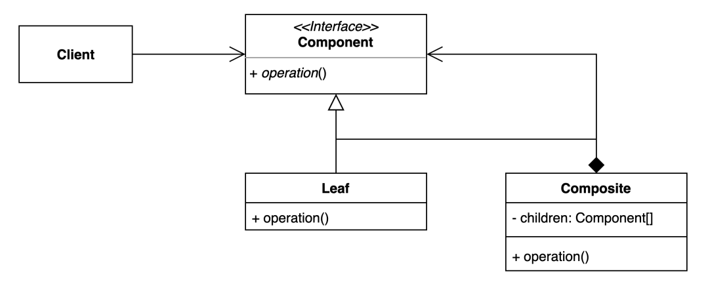

# 컴포짓(composite) 패턴
- 그룹 전체와 개별 객체를 동일하게 처리할 수 있는 패턴.
- 클라이언트 입장에서는 ‘전체’나 ‘부분’이나 모두 동일한 컴포넌트로 인식할 수는 계층 구조
  를 만든다. (Part-Whole Hierarchy)
- 클라이언트가 사용할 때 동일한 인터페이스를 사용하여 사용하는게 어떤 건지를 알 필요가 없음


# 패턴적용하기
## 변경 전
```kotlin
data class Item(
    val name: String,
    val price: Long
)

class Bag {
  val items: MutableList<Item> = mutableListOf()

  fun add(item: Item) {
    items.add(item)
  }
}
```

```kotlin
class Client {
    fun printPrice(item: Item) = println(item.price)

    fun printPrice(bag: Bag) = println(bag.items.sumOf { it.price })
}

fun main() {

    val doranBlade = Item(name = "도란검", price= 450)
    val healPostion = Item(name = "체력 물약", price= 50)

    val bag = Bag()
    bag.add(doranBlade)
    bag.add(healPostion)

    val client = Client()
    client.printPrice(doranBlade)
    client.printPrice(bag)
}
```

- `Item` class와 `Item`을 갖고 있는 `Bag` class를 생성
- 해당 class에 price를 가져오려고 할 때 client는 2개의 type에 대해서 method를 만들어야 함
- 만약에 새로운 type이 추가되는 경우 해당 type에 대해서 추가가 필요

## 변경 후
```kotlin
interface Component {

    fun sumPrice(): Long
}
```
- leaf(구체적인 class)가 아닌 Client는 Component type만 사용할 수 있게 수정

```kotlin
data class Item(
    val name: String,
    val price: Long
): Component {
    override fun sumPrice(): Long =
        price
}

class Bag: Component {
  private val items: MutableList<Component> = mutableListOf()

  fun add(item: Component) {
    items.add(item)
  }

  override fun sumPrice(): Long =
    items.sumOf { it.sumPrice() }
}
```

- `Leaf`쪽에서 구체적인 operation 을 정의해두고 Client가 operation을 사용하는 방식으로 변경

```kotlin
class Client {
    fun printPrice(component: Component) {
        println(component.sumPrice())
    }
}

fun main() {

    val doranBlade = Item(name = "도란검", price= 450)
    val healPostion = Item(name = "체력 물약", price= 50)

    val bag = Bag()
    bag.add(doranBlade)
    bag.add(healPostion)

    val client = Client()
    client.printPrice(doranBlade)
    client.printPrice(bag)
}
```
- 기존에는 type별로 printPrice하는 method를 구현했어야 하나, Client가 사용하는 type을 `Leaf`에서 `Component` type으로 변경하여
추가적인 print method를 구현하지 않아도 됨

# 장점과 단점
## 장점
- Bag, Item과 같이 트리구조로 되어 있는 케이스에 대해서 편리하게 사용할 수 있다.
- interface로 되어 있어 다형성을 활용할 수 있다.
- List<Component>로 활용한다면 재귀 방식, 반복문에서도 활용할 수 있다.
- interface를 활용하기에 클라이언트 코드를 변경하지 않고 새로운 엘리먼트 타입을 추가할 수 있다.
## 단점
- 트리를 만들어야 하기 때문에(공통된 인터페이스를 정의해야 하기 때문에) 지나친 일반화 해야 하는 경우도 생길 수 있다.
- Client에서 type check가 들어가게 된다면 너무 일반화해서 작성한건 아닌지에 대해서 의심을 해서 수정해야 할 수 있음
# 과제
- 자동 스킬을 사용해주는 컴포지트 패턴을 구현
- 용사의 레벨이 올라가면서 습득하는 스킬이 늘어나는데, 스킬이 늘어나더라도 기존에 스킬에 영향을 주지 않고 변경될 수 있도록 작성하기
