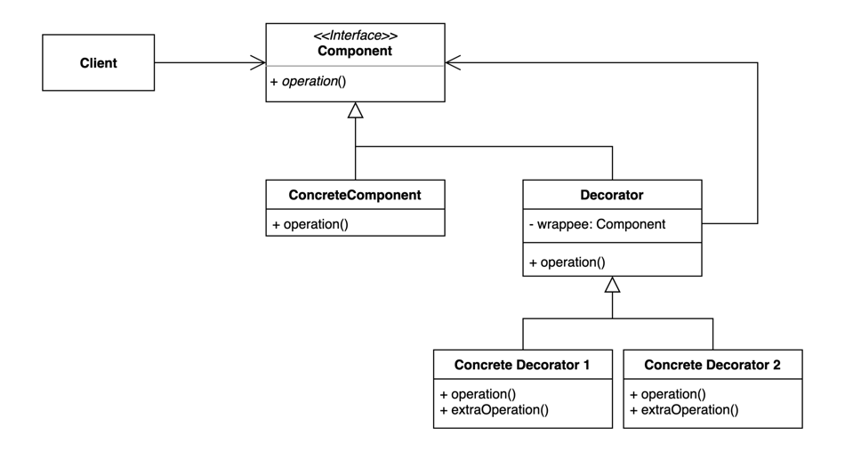

# Decorator Pattern 
- 기존 코드를 변경하지 않고 부가 기능을 추가하는 패턴
- Decorator라는 wrapping을 통해 본래 기능을 좀더 확장시켜서 사용할 수 있게 해주는 패턴
- 아래 예제에서 decorator를 사용한다면, 기존의 operation 기능 외의 extraOperation을 수행할 수 있는 decorator를 만들고,
이 decorator가 component를 wrapping하여서 사용한다. 


# 패턴적용하기
## 변경 전
```kotlin
open class CommentService {
  open fun addComment(comment: String) {
    println(comment)
  }
}

// 확장 
class SpamFilteringCommentService : CommentService(){

  override fun addComment(comment: String) {
    val isSpam = isSpam(comment)
    if (!isSpam) {
      super.addComment(comment)
    }
  }
  private fun isSpam(comment: String): Boolean {
    return comment.contains("http")
  }
}

fun main(args: Array<String>) {
  val client: Client = Client(SpamFilteringCommentService())
  client.writeComment("오징어게임")
  client.writeComment("보는게 하는거 보다 재밌을 수가 없지...")
  client.writeComment("http://whiteship.me")
}
```


## 변경 후
```kotlin
open class CommentDecorator(
  private val commentService: CommentService
) : CommentService {
  override fun addComment(comment: String) {
    commentService.addComment(comment)
  }
}
```
- commentService를 wrapping하는 decorator가 존재 

```kotlin
interface CommentService {
  fun addComment(comment: String)
}

class DefaultCommentService : CommentService {
  override fun addComment(comment: String) {
    println(comment)
  }
}
```
- 기본적인 commentService가 있고 

```kotlin
class SpamFilteringDecorator(
  val commentService: CommentService,
) : CommentDecorator(commentService) {

  override fun addComment(comment: String) {
    if (isNotSpam(comment)) {
      super.addComment(comment)
    }
  }

  private fun isNotSpam(comment: String): Boolean {
    return !comment.contains("http")
  }
}

fun main(args: Array<String>) {
  var commentService: CommentService = DefaultCommentService()
  if (enabledSpamFilter) {
    commentService = SpamFilteringDecorator(commentService)
  }
  val client = Client(commentService)
  client.writeComment("오징어게임")
  client.writeComment("보는게 하는거 보다 재밌을 수가 없지...")
  client.writeComment("http://whiteship.me")
}
```
- extraOperation이 필요할때마다 component를 감싼 decorator를 가지고 와서 수행한다. 

## 장점과 단점
### 장점
- 새로운 클래스를 만들지 않고 기존 기능을 조합할 수 있다. 
  - 각 클래스는 각자의 일을 하고 조합은 다른쪽에서 한다 (단일 책임 원칙)
    
- 컴파일 타임이 아닌 런타임에 동적으로 기능을 변경할 수 있다.
    - 조합이 동적으로 이루어지기 때문에 이에 대해 코드 작성시에 신경쓸 필요가 없음.
    
- interface를 사용함으로서 의존성을 역전시킬 수 있다. 

### 단점
- 데코레이터를 조합하는 코드가 복잡할 수 있다.

## 과제
DetailedInspection과 Inspection을 데코레이터 패턴을 이용해 리팩토링 해보세요~!
