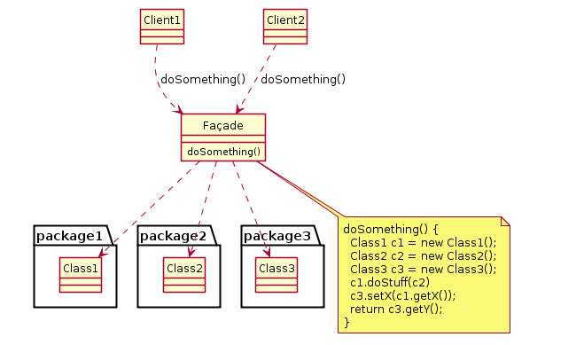
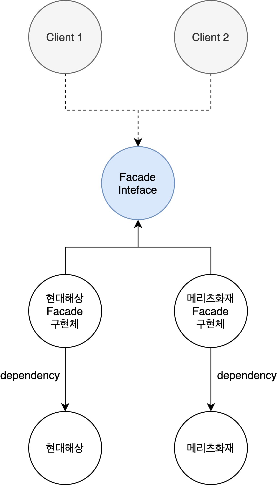

# Facade Pattern



- **퍼사드 패턴** : 복잡한 서브 시스템의 의존성을 최소화하는 방법
  - 클라이언트가 사용해야 하는 복잡한 서브 시스템의 의존성을 간단한 인터페이스로 추상화 할 수 있다.
  - 클라이언트가 인터페이스나 클래스의 인스턴스(서브시스템)를 만들어서 복잡한 구조로 사용하지 않고 퍼사드를 사용한다.
  - facade : (건물의)정면, (실제와는 다른)표면

### 의존성 철학
- Tightly Coupled : 강한 결합
- Loosely Coupled : 느슨한 결합

### 1. 의존성 강한 코드
```kotlin
// Tightly Coupled
fun main() {
  val to = "study@toss.im"
  val from = "gof@toss.im"
  val host = "127.0.0.1"

  val properties: Properties = System.getProperties()
    .apply { setProperty("mail.smtp.host", host) }

  val session: Session = Session.getDefaultInstance(properties)

  try {
    val message: MimeMessage = MimeMessage(session)
      .apply {
        setFrom(InternetAddress(from))
        addRecipient(Message.RecipientType.TO, InternetAddress(to))
        setSubject("Mail from gof design pattern study")
        setText("message")
      }

    Transport.send(message)
  } catch (e: MessagingException) {
    e.printStackTrace()
  }
}
```

### 2. 느슨한 구조로 만들기 위한 추상화 과정
- 메일의 설정하는 역할
- 메일의 메시지 역할
- 메일을 보내는 역할

```kotlin
/**
 * 이메일 설정 클래스
 */
class EmailSettings(
  val host: String
)

/**
 * 메시지 클래스
 */
class EmailMessage(
  val from: String,
  val to: String,
  val subject: String,
  val text: String
)

/**
 * 메시지 전송 Facade
 */
class EmailSender(
  private val emailSettings: EmailSettings
) {
  fun sendEmail(emailMessage: EmailMessage) {
    val properties: Properties = System.getProperties()
      .apply { setProperty("mail.smtp.host", emailSettings.host) }

    val session: Session = Session.getDefaultInstance(properties)

    try {
      val message: MimeMessage = MimeMessage(session)
        .apply {
          setFrom(InternetAddress(emailMessage.from))
          addRecipient(Message.RecipientType.TO, InternetAddress(emailMessage.to))
          setSubject(emailMessage.subject)
          setText(emailMessage.text)
        }

      Transport.send(message)
    } catch (e: MessagingException) {
      e.printStackTrace()
    }
  }
}

/**
 * 클라이언트
 */
fun main() {
  val emailSettings = EmailSettings("127.0.0.1")
  val emailMessage = EmailMessage("study@toss.im", "gof@toss.im", "디자인 패턴 스터디", "디자인 패턴 뿌수자!")

  val emailSender = EmailSender(emailSettings)
  emailSender.sendEmail(emailMessage)
}
```

- 라이브러리를 테스트 하는 것보다 직접 구현한 클래스가 mocking이 수월해진다.
- EmailSender를 인터페이스로 정의하고 비즈니스에 맞게 여러 구현체를 둘 수 있다.
- 조삼모사 아닌가 : 기존 클라이언트에서 사용하던 코드가 단순하게 래핑된 거 아닌가? 
  - But : 여러 곳에서 퍼사드를 사용한다면 복잡하게 구현된 라이브러리에 직접 의존할 필요없이 래핑된 클래스를 이용할 수 있음.

### 3. 퍼사드 패턴의 장점과 단점
- 장점
  - 서브 시스템에 대한 의존성을 한 곳으로 모을 수 있다. (MailSender)
- 단점
  - 퍼사드 클래스가 서브 시스템에 대한 모든 의존성을 가지게 된다.

- 기선님 의견
  - '코드(클라이언트)를 읽는게 편하다'면 의미있는 리팩토링이다.
  - 이메일을 보내기 위해 서브 시스템(API)에 대한 깊이있는 이해가 필요한데, 퍼사드로 추상화를 하면 필요한 기능만 이해하고 빠르게 코드를 작성할 수 있다.

- 정리해보면
  - **퍼사드는 복잡한 구현체를 숨기고 인터페이스로 추상화 해서 꼭 필요한 요소만을 제공한다.**

### 4. 자바와 스프링에서 찾아보는 패턴
- 특정 패턴인 A다 라고 말하는 것이 애매할 수 있다. 왜냐하면 보는 시각에 따라 다른 패턴으로 볼 수 있기 때문이다.
- 스프링 MVC를 퍼사드로 볼 수 있다. 자바 서블릿을 감싸고 있는 스프링 MVC
- 서블리싱 아닌 스프링 5 webflux로 동작할 수도 있다.
- 철학 : 특정 기술에 종속되지 않는 인터페이스를 설계

```kotlin
class FacadeInSpring {
  fun main() {
    val mailSender: MailSender = JavaMailSenderImpl()

    // 퍼사드 : PlatformTransactionManager, JdbcTransactionManager
    // 실제로 감춰져 있는 것 : jdbc API
    val platformTransactionManager: PlatformTransactionManager = JdbcTransactionManager()
  }
}
```

## 과제
- 간편 보험 가입을 위한 퍼사드를 구현한다.
  - 서브 시스템 : 현대해상, 메리츠화재
  - 퍼사드 인터페이스와 서브 시스템을 감싼 구현체  

<div align="center">
  
</div>
