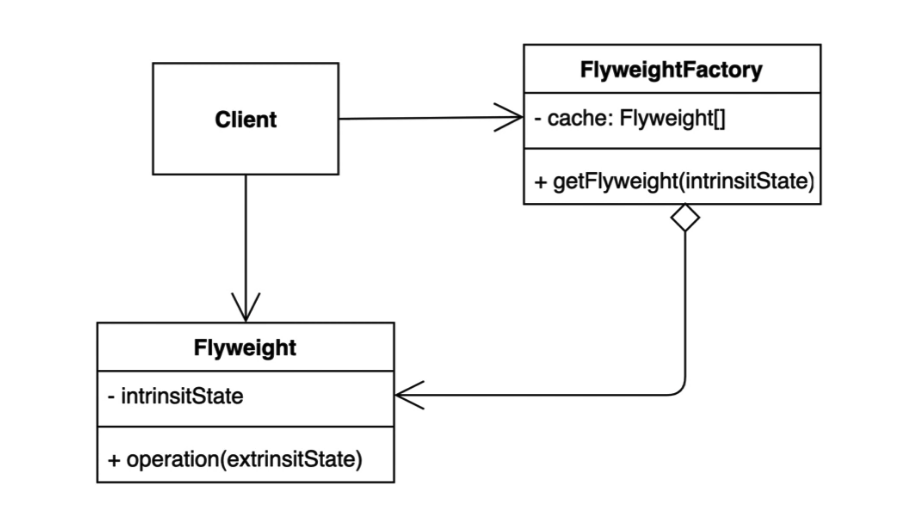

# Fly Weight Pattern



## 플라이 웨이트 패턴
- 객체를 가볍게 만들어 메모리 사용을 줄이는 패턴
- 자주 변하는(외적인, extrinsit) 과 변하지 않는 속성(내적인, intrinsit) 을 분리하고 재사용하여 메모리 사용을 줄임


## 장점과 단점 
- 장점
    - 애플리케이션에서 사용하는 메모리를 줄일 수 있다.
    - 재사용되는 객체들을 한군데서 모아서 처리할 수 있다.
- 단점
    - 코드의 복잡도가 증가한다.
    - 객체의 값을 변경하면 객체를 공유받은 다른 부분에 영향을 줄 수 있다.

## 자바와 스프링에서 찾아보는 패턴


```java
    /**
     * Returns an {@code Integer} instance representing the specified
     * {@code int} value.  If a new {@code Integer} instance is not
     * required, this method should generally be used in preference to
     * the constructor {@link #Integer(int)}, as this method is likely
     * to yield significantly better space and time performance by
     * caching frequently requested values.
     *
     * This method will always cache values in the range -128 to 127,
     * inclusive, and may cache other values outside of this range.
     *
     * @param  i an {@code int} value.
     * @return an {@code Integer} instance representing {@code i}.
     * @since  1.5
     */
    @HotSpotIntrinsicCandidate
    public static Integer valueOf(int i) {
        if (i >= IntegerCache.low && i <= IntegerCache.high)
            return IntegerCache.cache[i + (-IntegerCache.low)];
        return new Integer(i);
    }
```

## 관련된 패턴

- SingleTon 패턴 : FlyweightFactory 를 Singleton 으로 구현하는 경우가 있음
- Coposite 패턴 : Composite 패턴의 Leaf 를 Flyweight 를 이용하여 구성할 수 있는 경우가 있음

