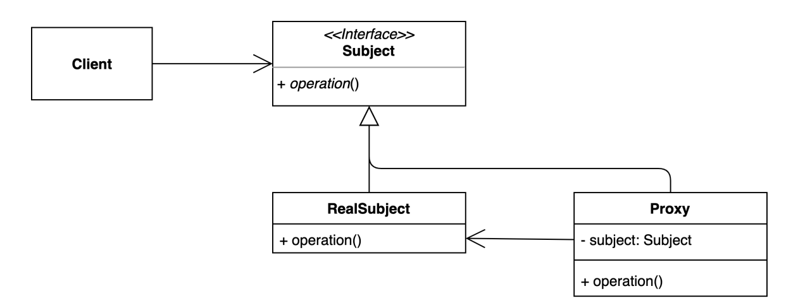

# 프록시 (Proxy) 패턴
- 특정 객체에 대한 접근을 제어하거나 기능을 추가할 수 있는 패턴.
- 초기화 지연, 접근 제어, 로깅, 캐싱 등 다양하게 응용해 사용 할 수 있다.
- 어떤 액션을 취하기 전, 후에 기능을 추가 해준다.
- 클라이언트가 `real subject`를 바로 사용하는게 아니라 `subject` interface를 사용하고, 실제로는 `proxy`에 
의해서 처리 된다.
- interface 방식과 상속 방식이 있지만 여기서는 interface만 설명
- 라이브러리 처럼 코드 수정이 어려운 경우는 상속을 통해서 오버라이딩해서 사용할 수 있지만, 상속이 안되거나 코드 수정이 어려운 경우는 interface 를 활용하는게 좋다.
- proxy는 interface type으로 필드를 갖고 있는데, 마치 데코레이터 패턴과 비슷함



## Before
```kotlin
open class GameService {

    open fun startGame() {
        sleep(1000L)
        println("이 자리에 오신 여러분을 진심으로 환영합니다.")
    }
}

fun main() {
    val client = GameService()

    client.startGame()
}
```
- client가 startGame을 호출하기 전, 후에 작업을 추가하기 위해서는 client쪽 코드 수정을 하던지, GameService 에 코드 수정이 필요하게 된다.
## After

```kotlin
// 코드 수정이 어려운 경우 상속을 활용하는 방식
class GameServiceProxyExtends : GameService() {

    override fun startGame() {
        val startTime = System.currentTimeMillis()
        super.startGame()
        val endTime = System.currentTimeMillis()
        println("걸린 시간: ${endTime - startTime}")
    }
}

fun main() {
    val client = GameServiceProxyExtends()

    client.startGame()
}
```
- client 코드와 GameService 코드는 수정하지 않고, 전처리나, 후 처리 작업을 추가하기 위해서 Proxy 객체를 추가하여 startGame 
에 대해 걸린 시간 측정에 대한 코드를 추가함
- 상속을 사용하는 경우는, GameService 코드를 수정하지 못하는 경우에 사용되고, 상속보다는 인터페이스 방식이 더 좋다
- 왜 좋은가? 
- 테스트 코드 작성이 쉽고, 유연한 코드 상태가 된다
- 상속을 사용하면, 1개만 상속된다는 제약사항, final class면 상속 불가 라는 제약사항이 있어서 인터페이스 방식이 더 좋음

```kotlin
interface GameService {
    fun startGame()
}

class DefaultGameService : GameService{
    override fun startGame() {
        Thread.sleep(1000L)
        println("이 자리에 오신 여러분을 진심으로 환영합니다.")
    }
}


data class GameServiceProxy(
    private val gameService: GameService
): GameService {
    override fun startGame() {
        val startTime = System.currentTimeMillis()
        gameService.startGame()
        val endTime = System.currentTimeMillis()
        println("걸린 시간: ${endTime - startTime}")
    }
}

fun main() {
    val gameService = GameServiceProxy(DefaultGameService())

    gameService.startGame()
}
```
- interface를 사용한 방식으로 proxy에서는 gameService 라는 interface를 갖고 있어서 gameService에 startGame 을 호출 전후에
원하는 작업을 할 수 있다.
- 자신이 자신의 service를 들고 있는게 데코레이터 패턴과 비슷한 구조이다.
- 원하는 gameService를 주입하고, 해당 gameService에 걸린 시간을 측정하는 proxy를 추가할 수 있음

## 장점과 단점
### 장점
- 기존 코드를 변경하지 않고 새로운 기능을 추가할 수 있음. (OCP)
- 기존 코드가 해야 하는 일만 유지할 수 있다. (SRP)
- 기존에 동작하고 있던 gameService가 하는걸 그대로 두고 proxy를 통해서 기능을 추가했기 때문
- 기능 추가 및 초기화 지연, 캐시 등으로 다양하게 활용할 수 있다.
### 단점
- 기존에 간단한 코드였는데, interface, 추가 클래스가 추가되기에 코드의 복잡도가 증가한다.

# 자바와 스프링에서 찾아보는 패턴
```kotlin
fun main() {
    dynamicProxy()
}

internal fun dynamicProxy() {
    val gameServiceProxy = getGameServiceProxy(DefaultGameService())
    gameServiceProxy.startGame()
}
internal fun getGameServiceProxy(target: GameService): GameService {
    return Proxy.newProxyInstance(GameService::class.java.classLoader, arrayOf(GameService::class.java)
    ) { proxy, method, args ->
        return@newProxyInstance if (args == null) {
            method.invoke(target, *emptyArray())
        } else {
            method.invoke(target, args)
        }
    } as GameService
}
```
- proxy에서 해야 하는 일을 여러 메소드, 여러 클래스에 적용하려면 코드 중복이 발생하는데, 다이나믹 프록시를 사용하여 런타임에 생성해서 사용할 수 있음

```kotlin
@Aspect
@Component
class PerfAspect {
    @Around("bean(gameService)")
    fun timestamp(point: ProceedingJoinPoint){
        val before = System.currentTimeMillis()
        point.proceed()
        println("걸린 시간 :${System.currentTimeMillis() - before}")
    }
}

@Service
class GameService {
    fun startGame() {
        println("이 자리에 오신 여러분을 진심으로 환영합니다.")
    }
}


@SpringBootApplication
class App {
    @Bean
    fun applicationRunner(gameService: GameService): ApplicationRunner {
        return ApplicationRunner {
            gameService.startGame()
        }
    }

}

fun main(args: Array<String>) {
    val app = SpringApplication(App::class.java)
    app.webApplicationType = WebApplicationType.NONE
    app.run(*args)
}
```
- spring에 aspect를 이용한 proxy 구현 방법
- interface로 만들지 않으면 cglib에 의해서 proxy가 생성된다.
# 과제
- proxy를 이용한 local cache 구현하기 
