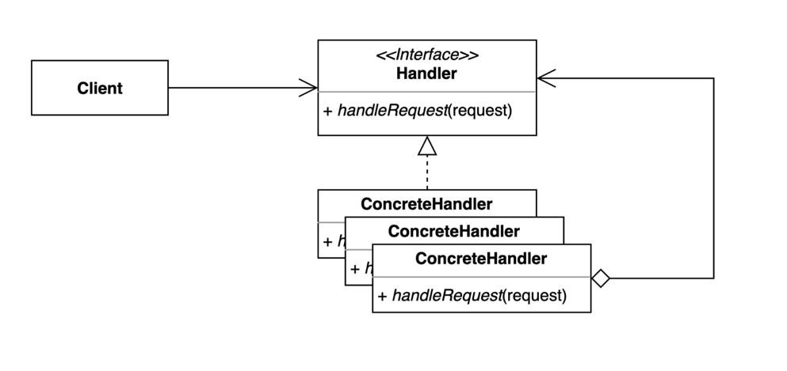

# 책임 연쇄(chain of responsibility)패턴

- 요청을 보내는 쪽(sender)과 요청을 처리하는 쪽(receiver)의 분리하는 패턴
- A라는 요구사항을 어디에서 처리해야할지 모를때 이를 계속 chain으로 넘김으로서 처리할 수 있는 쪽에서 처리를 하도록 한다.

~~~kotlin
open class RequestHandler {
    open fun handler(request: Request) {
        println(request.body)
    }
}
~~~

이렇게 request의 body를 찍는 handler가 있다고 하자 여기에 요구사항이 더 붙어서 logging을 해야할 필요가 있다면 아래와 같이 구현할 수 있다

~~~kotlin
class LoggingRequestHandler : RequestHandler() {
    override fun handler(request: Request) {
        println("logging handler")
        super.handler(request)
    }
}
~~~

그리고 클라이언트쪽에서 어떤 requestHandler를 쓸것인지 결정해줘야한다.

~~~kotlin
class Client {
    fun main(args: Array<String>) {
        val request = Request("무궁화 꽃이 피었습니다.")
        val requestHandler: RequestHandler = LoggingRequestHandler()
        requestHandler.handler(request)
    }
}
~~~

이에 chain of responsibility를 적용하면

~~~kotlin 
abstract class RequestHandler(private val nextHandler: RequestHandler?) {
    open fun handle(request: Request) {
        nextHandler?.handle(request)
    }
}
~~~

이렇게 nextHandler를 받아서 nextHandler가 있을 경우 handle을 호출하는 식으로 구현후

~~~
class AuthRequestHandler(nextHandler: RequestHandler?) : RequestHandler(nextHandler) {
    override fun handle(request: Request) {
        println("인증이 되었는가?")
        super.handle(request)
    }
}

class PrintRequestHandler(nextHandler: RequestHandler?) : RequestHandler(nextHandler) {
    override fun handle(request: Request) {
        println(request.body)
        super.handle(request)
    }
}
~~~

각 handle에서는 super.handle을 호출하고

~~~
class Client(val requestHandler: RequestHandler) {

    fun doWork() {
        val request = Request("이번 놀이는 뽑기입니다.")
        requestHandler.handle(request)
    }
}

fun main(args: Array<String>) {
    val chain = AuthRequestHandler(PrintRequestHandler(null))
    val client = Client(chain)
    client.doWork()
}
~~~

설정시 handler chain을 생성자에 같이 넣어준다.

## 장점

- 클라이언트 코드를 변경하지 않고 새로운 핸들러를 체인에 추가할 수 있다.
- 각각의 체인은 자신이 해야하는 일만 한다.
- 체인을 다양한 방법으로 구성할 수 있다.

## 단점

- 디버깅이 조금 어렵다

## 자바와 스프링에서 찾아보는 패턴

- 서블릿 필터
- 시큐리티 필터

## 과제

과제는 없습니다..! 
