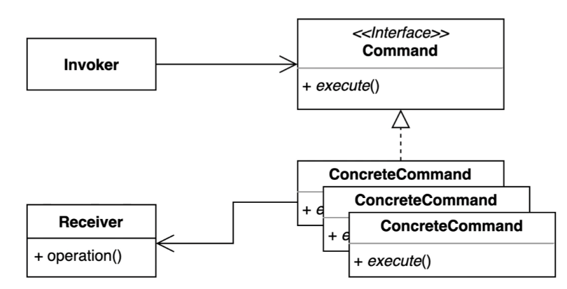

# 커맨드 패턴 (Command Pattern)



- 요청을 캡슐화 하여 호출자(invoker)와 수신자(receiver)를 분리하는 패턴.
- 커맨드 안에 어떤 operation 을 호출해야 하는지 **명령을 수행하기 위한 모든 작업을 커맨드 인터페이스 안으로 캡슐화**
- 구성요소
  - Invoker : 커맨드를 참조. 커맨드를 실행하는 역할
  - Command : 여러 구체적인 커맨드들을 추상화한 인터페이스 (추상 클래스도 가능)
  - ConcreteCommand : 커맨드 인터페이스를 구현한 구현체. 어떤 receiver를 사용할지 정의되어 있음. (작업을 제어) 
  - Receiver : 요청에 대한 작업을 수행하는 클래스


### Before
- 코드의 변경이 자주 발생
- 요청을 보내는 쪽에서 비슷한 코드가 중복됨
- invoker 와 receiver 간의 강결합 관계

```kotlin
// receiver
class Light {
  fun on() {
    println("불을 켠다.")
  }

  fun off() {
    println("불을 끈다.")
  }
}

class Game{
  private var isStarted: Boolean = false

  fun start() {
    println("게임 시작.")
    isStarted = true
  }

  fun end() {
    println("게임 종료.")
    isStarted = false
  }

  fun isStarted(): Boolean = isStarted
}
```

```kotlin
// invoker
class Button(
  private val light: Light
) {
  fun press() {
    light.on()
  }
}

class MyApp(
  private val game: Game
) {
  fun press() {
    game.start()
  }
}
```

### after
- command 인터페이스
- command 구현체
- invoker에서 이미 만들어져있는 command를 재사용할 수 있다.
- receiver의 변경이 invoker에 영향이 가지 않는다. command만 변경된다.

```kotlin
/**
 * 커맨드 인터페이스
 * @see Runnable 리턴하는 건 없고 뭔가를 실행하는 메소드만 정의되어 있음
 */
interface Command {
  fun execute()
}

class LightOnCommand(
  private val light: Light
) : Command {
  override fun execute() {
    light.on()
  }
}

class LightOffCommand(
  private val light: Light
) : Command {
  override fun execute() {
    light.off()
  }
}
```

#### runnable 인터페이스

```java
@FunctionalInterface
public interface Runnable {
  public abstract void run();
}
```

```kotlin
// command를 사용하는 invoker
class Button(
  private val command: Command
) {
  fun press() {
    command.execute()
  }
}
```

### 커맨드 패턴의 장점과 단점
- 장점
  - 기존의 코드를 변경하지 않고도 새로운 커맨드를 추가할 수 있다. (개방-폐쇄 원칙)
  - receiver 코드가 변경되더라도, invoker 코드가 변경되지 않는다.
  - 각각의 커맨드가 단일책임원칙을 따른다.
- 단점
  - 커맨드 객체들이 많이 늘어난다. 코드가 복잡해진다.

### 자바와 스프링에서 찾아보는 패턴
```java
// java 
Light light = new Light();
Game game = new Game();
ExecutorService executorService = Executors.newFixedThreadPool(4);  // 스레드풀 생성
executorService.submit( // 익명 내부 클래스
  new Runnable() {...}
);
executorService.submit(light::on);  // method reference
executorService.submit(game::start);
executorService.submit(game::end);
executorService.submit(light::off);
executorService.shutdown();
```

```java
public void add(Command command) {
  SimpleJdbcInsert insert = new SimpleJdbcINsert(dataSource)
    .withTableName("command")
    .usingGeneratedKeyColumns("id");
  Map<String, Object> data = new HashMap<>();
  data.put("name", command.getClass().getSimpleName());
  data.put("when", LocalDateTime.now());
  insert.execute(data);
}
```
