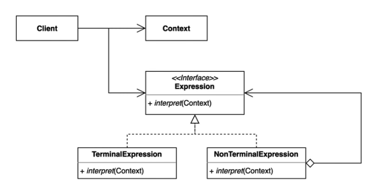

# 인터프리터 패턴

자주 등장하는 문제를 간단한 언어로 정의하고 재사용하는 패턴  
반복되는 문제 패턴을 언어 또는 문법으로 정의하고 확장할 수 있다.

한 클래스 내의 여러 메서드에서 일종의 묵시적 언어를 이루는 요소들을 조합하고 있다면, 그 묵시적 언어의 요소들을 각각의 클래스로 정의하고 그 객체의 조합을 통해 해석 가능한 수식을 만들어낼 수 있도록 한다



---

# 장점과 단점

- 장점
    - 자주 등장하는 문제 패턴을 언어와 문법으로 정의할 수 있다.
    - 기존 코드를 변경하지 않고 새로운 Expression을 추가할 수 있다.
- 단점
    - 복잡한 문법을 표현하려면 Expression 과 Parser가 복잡해진다.

-- -

# 자바와 스프링에서 찾아보는 인터프리터 패턴


## 자바의 정규식
```java
public class InterpreterInJava {

    public static void main(String[] args) {
        System.out.println(Pattern.matches(".pr...", "spring"));
        System.out.println(Pattern.matches("[a-z]{6}", "spring"));
        System.out.println(Pattern.matches("white[a-z]{4}[0-9]{4}", "whiteship2000"));
        System.out.println(Pattern.matches("\\d", "1")); // one digit
        System.out.println(Pattern.matches("\\D", "a")); // one non-digit
    }
}


/// Regex 의 Begin 클래스
static final class Begin extends Node {
  boolean match(Matcher matcher, int i, CharSequence seq) {
    int fromIndex = (matcher.anchoringBounds) ?
      matcher.from : 0;
    if (i == fromIndex && next.match(matcher, i, seq)) {
      matcher.first = i;
      matcher.groups[0] = i;
      matcher.groups[1] = matcher.last;
      return true;
    } else {
      return false;
    }
  }
}

/// Regex 의 End 클래스
static final class End extends Node {
  boolean match(Matcher matcher, int i, CharSequence seq) {
    int endIndex = (matcher.anchoringBounds) ?
      matcher.to : matcher.getTextLength();
    if (i == endIndex) {
      matcher.hitEnd = true;
      return next.match(matcher, i, seq);
    }
    return false;
  }
}


```

## 스프링의 SpEL 언어

런타임시에 객체 그래프를 조회하고 조작하는 표현 언어
```java
public class InterpreterInSpring {

    public static void main(String[] args) {
        Book book = new Book("spring");

        ExpressionParser parser = new SpelExpressionParser();
        Expression expression = parser.parseExpression("title");
        System.out.println(expression.getValue(book));
    }
}

@Value{2 + 4} // value 어노테이션도 SpEL 기반으로 동작

```

---

# 숙제
prefix Calculator 을 인터프리터 패턴으로 구현해보기

---
# References 

- 인터프리터 패턴 : https://johngrib.github.io/wiki/pattern/interpreter/
- 코틀린 DSL : https://techblog.woowahan.com/2625/

