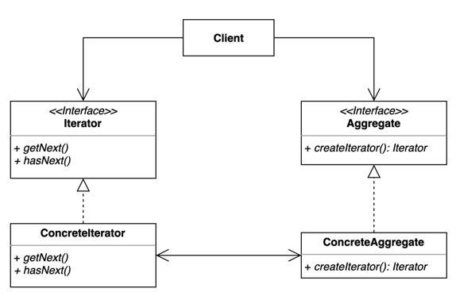
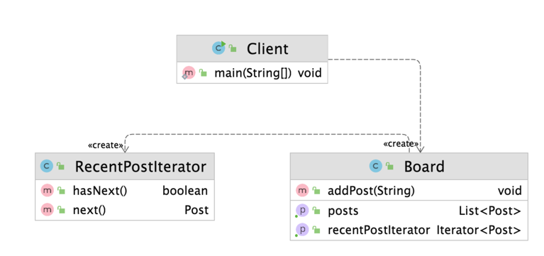

# 이터레이터(Iterator)
- 집합 객체 내부 구조를 노출시키지 않고 순회 하는 방법을 제공하는 패턴
- 집합 객체를 순회하는 클라이언트 코드를 변경하지 않고 다양한 순회 방법을 제공할 수 있다
- 
- 
# Before
```kotlin
fun main() {
    val board = Board()
    board.addPost("디자인 패턴 게임")
    board.addPost("선생님, 저랑 디자인 패턴 하나 학습하시겠습니까?")
    board.addPost("지금 이 자리에 계신 여러분들은 모두 디자인 패턴을 학습하고 계신 분들입니다.")

    val posts: List<Post> = board.getPosts() // List를 Client가 알게 됨
    for (i in 0 until posts.size) {
        val post = posts[i]
        println(post.title)
    }

    // 나중에 요구사항이 변경되서 최근 순으로 보려고 할 때 코드 수정이 들어감
    val sortedPosts = posts.sortedByDescending { it.createdDateTime }
    for (i in 0 until sortedPosts.size) {
        val post = sortedPosts[i]
        println(post.title)
    }
}

class Board {
    private val posts = mutableListOf<Post>()
    fun addPost(content: String) {
        val post = Post(content)
        posts.add(post)
    }

    fun getPosts(): List<Post> = posts
}

class Post(
    val title: String,
    val createdDateTime: LocalDateTime = LocalDateTime.now(),
)
```
- Client가 Board에 posts가 List로 되어 있다는것을 알고 있게 되고 Board에 posts가 바뀌면 Client에 영향을 받게 됨
# After

```kotlin
class RecentPostIterator : Iterator<Post>{
    private val internalIterator: Iterator<Post> // 직접 구현하지 않고 위임
    constructor(board: Board) {
        val posts = board.getPosts()
        this.internalIterator = posts.sortedByDescending { it.createdDateTime }.iterator()
    }

    override fun hasNext(): Boolean {
        return internalIterator.hasNext()
    }

    override fun next(): Post {
        return internalIterator.next()
    }
}

class Board {
    ...
    fun getRecentPostIterator() = RecentPostIterator(this)
}

fun main() {
    ...
    val recentPostIterator = board.getRecentPostIterator()
    while(recentPostIterator.hasNext()) {
        println(recentPostIterator.next().title)
    }
}
```
- Board 내부에 어떤 collection type의 posts를 사용하는지 알 필요가 없어짐

## 장단점

### 장점
- 집합 객체가 가지고 있는 객체들에 손쉽게 접근할 수 있다
- 예를들면 stack인 경우 pop을 써서 가져와야 하는데, iterator를 가져오면 hasNext와 next를 이용해서 순회가 가능하다
- 일관된 인터페이스를 사용해 여러 형태의 집합 구조를 순회할 수 있다
### 단점
- 클래스가 늘어나고 복잡도가 증가한다.

## 적용된 코드
### Java
- java.util.Enumeration과 java.util.Iterator
- Java StAX (Streaming API for XML)의 Iterator 기반 API
- XmlEventReader, XmlEventWriter
### 스프링
- CompositeIterator
# 과제
- 자동이체를 iterator로 구현해보기
