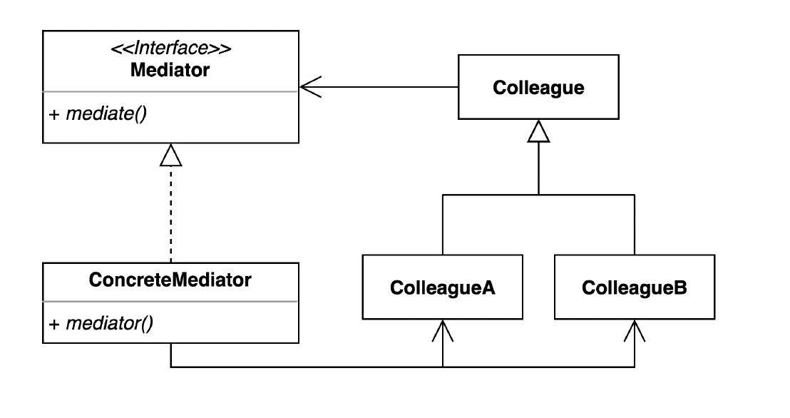
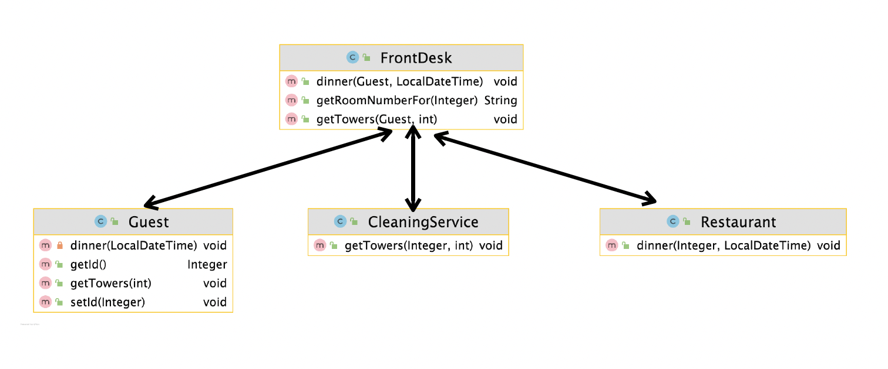

# 중재자(Mediator)
- 여러 객체들이 소통하는 방법을 캡슐화 하는 패턴
- 서로 관련된 객체 사이의 복잡한 통신과 제어를 한 곳으로 집중하고 싶을때 주로 사용
- 여러 컴포넌트간의 결합도를 중재자를 통해 낮출 수 있음
- 
- 

# Before
```kotlin
class CleaningService {

    fun clean(gym: Gym) {
        println("clean $gym")
    }

    fun getTower(guest: Guest, numberOfTower: Int) {
        println("$numberOfTower towers to $guest")
    }

    fun clean(restaurant: Restaurant) {
        println("clean $restaurant")
    }
}
```
```kotlin
data class Guest(
    val id: Long,
    val name: String,
    val restaurant: Restaurant,
) {
    private val cleaningService: CleaningService = CleaningService()

    fun dinner() {
        restaurant.dinner(this)
    }

    fun getTower(numberOfTower: Int) {
        cleaningService.getTower(this, numberOfTower)
    }
}
```
```kotlin
class Gym(
    val id: Long,
    val name: String,
){
    private val cleaningService: CleaningService = CleaningService()

    fun clean() {
        cleaningService.clean(this)
    }
}
```
```kotlin
data class Restaurant(
    val id: Long,
    val name: String,
) {
    private val cleaningService: CleaningService = CleaningService()

    fun dinner(guest: Guest) {
        println("dinner $guest")
    }

    fun clean() {
        cleaningService.clean(this)
    }
}
```
```kotlin
fun main() {
    val restaurant = Restaurant(1, "lotte hotel")
    val guest = Guest(1, "nathan", restaurant)
    guest.getTower(3)
    guest.dinner()
    restaurant.clean()
}
```


# After

```kotlin
class CleaningService {
    lateinit var frontDesk: FrontDesk

    fun getTowers(guestId: Long, numberOfTowers: Int) {
        val roomNumber = frontDesk.getRoomNumberFor(guestId)
        println("provide $numberOfTowers to $roomNumber");
    }
}
```
```kotlin
class FrontDesk {
    private lateinit var restaurant: Restaurant
    private lateinit var cleaningService: CleaningService

    private var guestRoom = mutableMapOf<Long, Long>()

    fun init(restaurant: Restaurant, cleaningService: CleaningService) {
        this.restaurant = restaurant
        this.cleaningService = cleaningService
    }

    fun getTowers(guest: Guest, numberOfTowers: Int) {
        cleaningService.getTowers(guest.id, numberOfTowers)
    }

    fun addGuestRoom(guestId: Long, roomId : Long) {
        guestRoom[guestId] = roomId
    }
    fun getRoomNumberFor(guestId: Long): Long? {
        return guestRoom[guestId]
    }
    fun dinner(guest: Guest, dateTime: LocalDateTime) {
        restaurant.dinner(guest.id, dateTime)
    }
}
```
```kotlin
data class Guest(
    val id: Long,
    val name: String,
    private val frontDesk: FrontDesk
) {

    fun dinner(dateTime: LocalDateTime) {
        frontDesk.dinner(this, dateTime)
    }

    fun getTower(numberOfTower: Int) {
        frontDesk.getTowers(this, numberOfTower)
    }
}
```
```kotlin
data class Restaurant(
    val id: Long,
    val name: String,
) {

    fun dinner(guestId: Long, dateTime: LocalDateTime) {
        println("dinner $guestId at $dateTime")
    }
}
```
- FrontDesk에서 통신과 제어를 집중 시키므로써, 각 컴포넌트 코드는 FrontDesk만 의존하면됨
- 예제에서는 FrontDesk를 클래스로 구현했지만, 중재자를 인터페이스로 구성하면 새로운 중재자 구현체를 만들어 컴포넌트 코드 변경없이 사용가능
- 이전 각 컴포넌트 코드가 간결해짐

## 장단점

### 장점
- 컴포넌트 코드를 변경하지 않고 새로운 중재자를 만들어 사용할 수 있다.
- 각각의 컴포넌트 코드를 보다 간결하게 유지할 수 있다.
### 단점
- 중재자 역할을 하는 클래스의 복잡도와 결합도가 증가한다.

## 적용된 코드
### Java
- ExecutorService
- Executor
### 스프링
- DispatcherServlet

