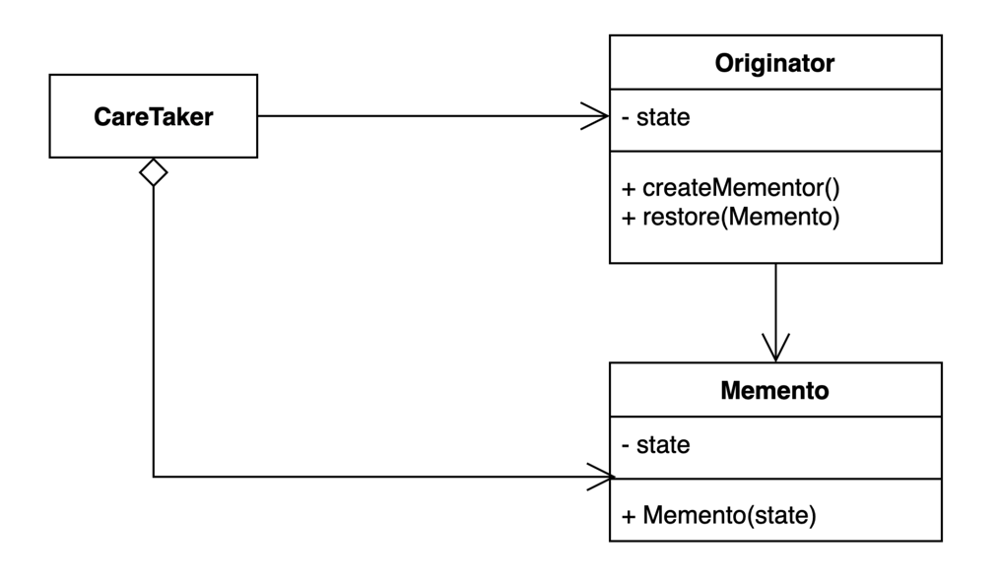

# 메멘토 패턴
캡슐화를 유지하면서 객체 내부 상태를 외부에 저장하는 방법 

어떤 객체의 상태를 객체외부에서 스냅샷을 떠서 저장하는 형태 

## BEFORE
~~~kotlin
data class Game(
    var redTeamScore: Int,
    var blueTeamScore: Int,
)
~~~

~~~kotlin
fun main() {

    val game: Game = Game(10, 20)
    
    // snapshot
    val blueTeamScore: Int = game.blueTeamScore
    val redTeamScore: Int = game.redTeamScore

    // restore
    game.blueTeamScore = blueTeamScore
    game.redTeamScore = redTeamScore
    var restoredGame: Game = game
}
~~~
객체의 상태를 field별로 따로따로 저장해야한다.
그리고 객체의 상태를 변경해주는 부분(restore)이 client에 위임되어있다 
만약 객체의 초기상태가 변하거나, field개수가 변하면 client코드가 변해야한다. 

## AFTER
~~~kotlin
// immutable
data class GameSave(
    val blueTeamScore: Int,
    val redTeamScore: Int
)
~~~

~~~kotlin
fun main() {

    val game: Game = Game(10, 20)
    val blueTeamScore: Int = game.blueTeamScore
    val redTeamScore: Int = game.redTeamScore
    println("blue : ${game.blueTeamScore}, red : ${game.redTeamScore}")
    // blue : 20, red : 10
   
    val restoredGame: GameSave = game.save()
    game.blueTeamScore = 21
    game.redTeamScore = 11
    println("blue : ${game.blueTeamScore}, red : ${game.redTeamScore}")
    // blue : 21, red : 11
    
    game.restore(restoredGame)
    println("blue : ${game.blueTeamScore}, red : ${game.redTeamScore}")
    // blue : 10, red : 20
}
~~~
GameSave라는 Game의 status를 저장하는 snapshot용 immutable data class를 생성한다.

## 장점과 단점

### 장점
- 캡슐화를 지키면서 상태 객체 상태 스냅샷을 만들 수 있다.
- 객체 상태 저장하고 또는 복원하는 역할을 CareTaker에게 위임할 수 있다
- 객체 상태가 바뀌어도 클라이언트 코드는 변경되지 않는다.
### 단점 
- 많은 정보를 저장하는 Mementor를 자주 생성하는 경우 메모리 사용량에 많은 영향을 줄 수 있다.

# 과제
없습니당!
