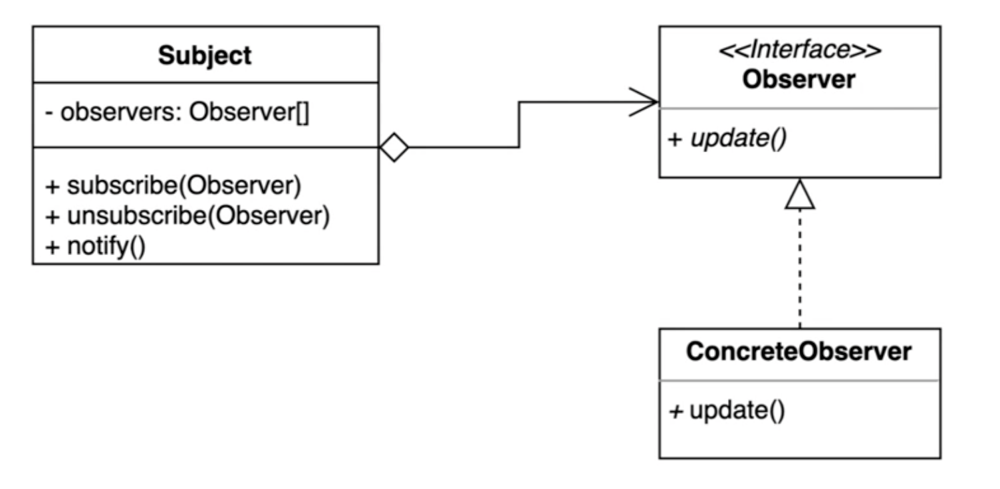

# 옵저버 패턴

- 다수의 객체가 특정 객체의 **상태 변화를 감지하고 알림을 받는 패턴**
  - 대상의 상태 변경을 감지하고 변경에 따른 반응이 필요할 때 적용하는 패턴
- 발행(publish) - 구독(subscribe) 패턴을 구현할 수 있다.


- `Subject` : 여러 Observer를 등록하거나 해지하는 기능. Subject의 상태가 변경되면 등록된 Observer를 순회하면서 Observer가 제공하는 메소드를 호출한다.
- `Observer` : Observer 인터페이스를 정의해서 Subject에서 함수를 호출할 수 있도록 제공한다.
- `ConcreteObserver` : 실제 Observer가 이벤트를 받아서 수행하는 구체확된 로직이 들어있는 구현체이다.
=> Subject에 Observer를 등록하고, Subject 변경이 발생했을 때 Observer에 변경 이벤트를 발행한다. 각각의 Observer 구현체마다 구독 후 처리 로직이 다르다. 


## before

```kotlin
fun main() {
  val chatServer = ChatServer()

  val user1 = User(chatServer)
  user1.sendMessage("디자인패턴", "이번엔 옵저버 패턴입니다.")
  user1.sendMessage("토스 상장", "파이팅!")

  // user2가 직접 getter를 호출해서 가져와야 한다.
  val user2 = User(chatServer)
  println(user2.getMessage("디자인패턴"))

  user1.sendMessage("디자인패턴", "예제 코드 보는 중..")
  println(user2.getMessage("디자인패턴"))
}
```

### after

```kotlin
interface Subscriber {
  fun handleMessage(message: String)
}

fun main() {
  val chatServer = ChatServer()
  val user1 = User("toss core")
  val user2 = User("toss bank")

  chatServer.register("오징어게임", user1)
  chatServer.register("오징어게임", user2)
  chatServer.register("디자인패턴", user1)

  chatServer.sendMessage(user1, "오징어게임", "아.. 이름이 기억났어.. 일남이야.. 오일남")
  chatServer.sendMessage(user2, "디자인패턴", "옵저버 패턴으로 만든 채팅")
}

```

## after

```kotlin
/**
 * Observer 인터페이스
 */
interface Subscriber {
  val name: String
  fun handleMessage(message: String)
}

/**
 * Observer 구현체
 */
class User(val name: String) : Subscriber {
  override fun handleMessage(message: String) {
    println(message)
  }
}

/**
 * Subject class
 */
class ChatServer {
  // 주제별로 observer 목록 관리
  private val subscribers : MutableMap<String, MutableList<Subscriber>> = mutableMapOf()

  fun register(topic: String, subscriber: Subscriber) {
    println("${subscriber.name} | $topic 구독")
    if (subscribers.containsKey(topic)) {
      subscribers[topic]!!.add(subscriber)
    } else {
      // 주의. immutable collection
      subscribers[topic] = mutableListOf(subscriber)
    }
  }

  fun sendMessage(subscriber: Subscriber, topic: String, message: String) {
    if (subscribers.containsKey(topic)) {
      val userMessage = "${subscriber.name}: $message"
      subscribers[topic]!!
        // observer 목록 순회하면서 메시지 전달
        .forEach { s -> s.handleMessage(userMessage) }
    }
  }

  // 변경
  fun sendMessage(topic: String, message: String) {
    if (subscribers.containsKey(topic)) {
      subscribers[topic]!!
        // observer 목록 순회하면서 메시지 전달
        .forEach { subscriber ->
          subscriber.handleMessage("${subscriber.name} | $message")
        }
    }
  }
}

/**
 * 클라이언트
 */
fun main() {
  val chatServer = ChatServer()
  val user1 = User(name = "toss core")
  val user2 = User(name = "toss bank")

  // observer 등록
  chatServer.register(topic = "오징어게임", subscriber = user1)
  chatServer.register(topic = "오징어게임", subscriber = user2)

  chatServer.register(topic = "디자인패턴", subscriber = user1)

  // 메시지 전송
  chatServer.sendMessage(topic = "오징어게임", message = "아.. 이름이 기억났어.. 일남이야.. 오일남")
  chatServer.sendMessage(topic = "디자인패턴", message = "옵저버 패턴으로 만든 채팅")

  chatServer.unregister(topic = "디자인패턴", subscriber = user1)
}
```

### 출력

```text
toss core | 오징어게임 구독
toss bank | 오징어게임 구독
toss core | 디자인패턴 구독
toss core | 아.. 이름이 기억났어.. 일남이야.. 오일남
toss bank | 아.. 이름이 기억났어.. 일남이야.. 오일남
toss core | 옵저버 패턴으로 만든 채팅
toss core | 디자인패턴 구독 해지
```

## 장점과 단점
- 장점
  - **상태를 변경하는 객체(publisher)와 변경을 감지하는 객체(subscriber)의 관계를 느슨하게 유지**할 수 있다.
  - subject의 상태 변경을 주기적으로 조회하지 않고 자동으로 감지할 수 있다.
  - 런타임에 옵저버를 추가하거나 제거할 수 있다.
  - subject에서 상태 변경에 대한 이벤트를 관리하기 때문에 중복 코드를 없앨 수 있다.
- 단점
  - 다수의 Observer 객체를 등록한 후 해제하지 않는다면 `memory leak`이 발생할 수도 있다.
- 기타
  - 폴링(polling) : 주기적으로 요청해서 가져오는 것
  - 백프래셔(backpressure) : 

## 자바에서 찾아보는 패턴
- Observer 인터페이스, Observable 클래스 : 자바 9 에서 deprecated
- PropertyChangeListener
- Flow : reactive stream 구현할 수 있도록 제공하는 인터페이스
  - Subscription
  - Subscriber
  - Publisher
  - Processor

## 스프링에서 찾아보는 패턴
- Application Context : event publisher

```kotlin
class MyEvent(
    source: Any,
    val message: String
) : ApplicationEvent(source)    // ApplicationEvent 사용하지 않아도 무방

@Component
class MyEventListener : ApplicationListener<MyEvent> {
  override fun onApplicationEvent(event: MyEvent) {
    println("${event.source} | ${event.message}")
  }
}

@Component
class MyRunner(
  private val publisher: ApplicationEventPublisher
) : ApplicationRunner {
  override fun run(args: ApplicationArguments?) {
    publisher.publishEvent(MyEvent(this, "hello spring event"))
  }
}
```
