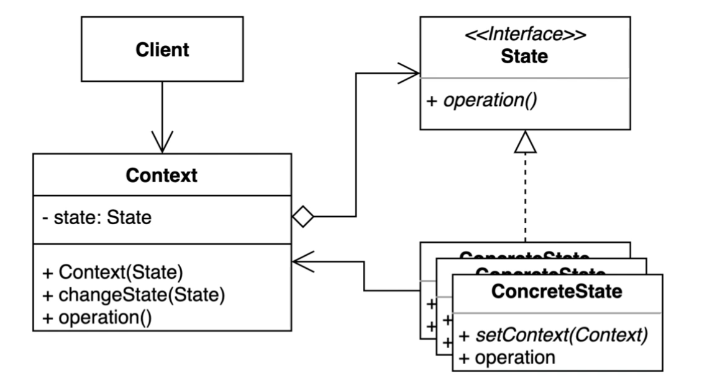
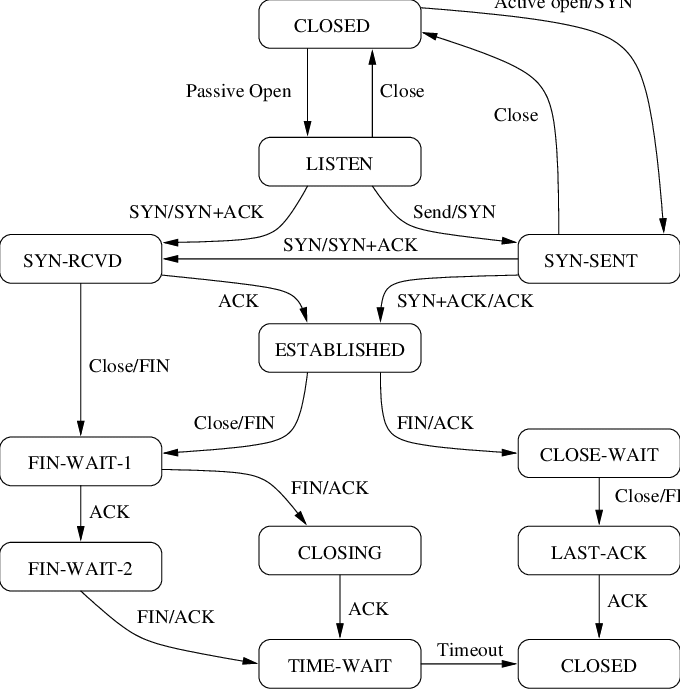

# 상태(State) 패턴

객체 내부 상태 변경에 따라 객체의 행동이 달라지는 패턴  
상태에 특화된 행동들을 분리해 낼 수 있으며, 새로운 행동을 추가하더라도 기존 행동에 영향을 주지 않는다.



- `context` 
    - 사용자가 관심 있는 인터페이스를 정의한다.
    - 객체의 각 상태를 정의한 State의 구현체 인스턴스를 관리한다.
- `state` 
    - Context의 각 상태별 행동을 정의한다.

---
## before 

```kotlin
// 상태에 따른 리뷰 남기기 동작 분기
fun addReview(review: String, student: Student) {
        if (state == State.PUBLISHED) {
            reviews.add(review)
        } else if (state == State.PRIVATE && students.contains(student)) {
            reviews.add(review)
        } else {
            throw UnsupportedOperationException("리뷰를 작성할 수 없습니다.")
        }
}

// 상태에 따른 학생 추가 동작 분기
fun addStudent(student: Student) {
        if (state == State.DRAFT || state == State.PUBLISHED) {
            students.add(student)
        } else if (state == State.PRIVATE && availableTo(student)) {
            students.add(student)
        } else {
            throw UnsupportedOperationException("학생을 해당 수업에 추가할 수 없습니다.")
        }
        if (students.size > 1) {
            state = State.PRIVATE
        }
    }
```

## after
```kotlin
// 상태 interface
interface State {
    fun addReview(review: String, student: Student)
    fun addStudent(student: Student)
}

// 강의 class
class OnlineCourse {
    var state: State = Draft(this)
    val students: MutableList<Student> = mutableListOf()
    val reviews: MutableList<String> = mutableListOf()

    fun addStudent(student: Student) {
        state.addStudent(student)
    }

    fun addReview(review: String, student: Student) {
        state.addReview(review, student)
    }

    fun changeState(state: State) {
        this.state = state
    }
}

// published state

class Published(private val onlineCourse: OnlineCourse) : State {
    override fun addReview(review: String, student: Student) {
        onlineCourse.reviews.add(review)
    }

    override fun addStudent(student: Student) {
        onlineCourse.students.add(student)
    }
}

// private state
class Private(private val onlineCourse: OnlineCourse) : State {
    override fun addReview(review: String, student: Student) {
        if (onlineCourse.students.contains(student)) {
            onlineCourse.reviews.add(review)
        } else {
            throw UnsupportedOperationException("프라이빗 코스를 수강하는 학생만 리뷰를 남길 수 있습니다.")
        }
    }

    override fun addStudent(student: Student) {
        if (student.isAvailable(onlineCourse)) {
            onlineCourse.students.add(student)
        } else {
            throw UnsupportedOperationException("프라이빛 코스를 수강할 수 없습니다.")
        }
    }
}
```
---

## 장점과 단점

### 장점 
- 상태에 따른 동작을 개별 클래스로 옮겨 구현할 수 있다. 
- 기존 특정 상태에 따른 동작을 변경하지 않고 새로운 상태를 구현할 수 있다. 
- 코드 복잡도를 줄이 수 있다.

### 단점 
- 복잡도가 증가한다.

---

## 사용 예

TCP 구현체에 해당 패턴이 적용되었음 



### State
- TCPClosed implements TCPState
- TCPEstablished implements TCPState
- TCPListen implements TCPState
- TCPClosed implements TCPState

---

## 숙제

유저의 상태에 따른 탈퇴 로직분기를 상태 패턴 적용


