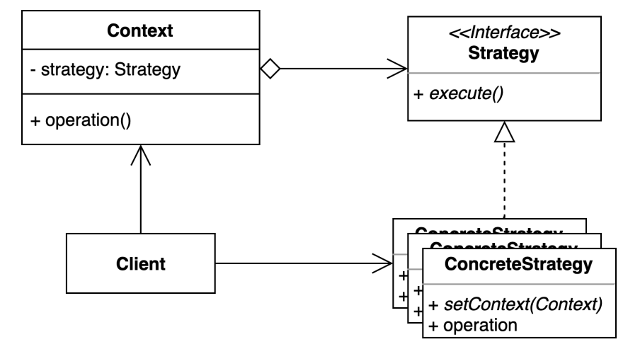
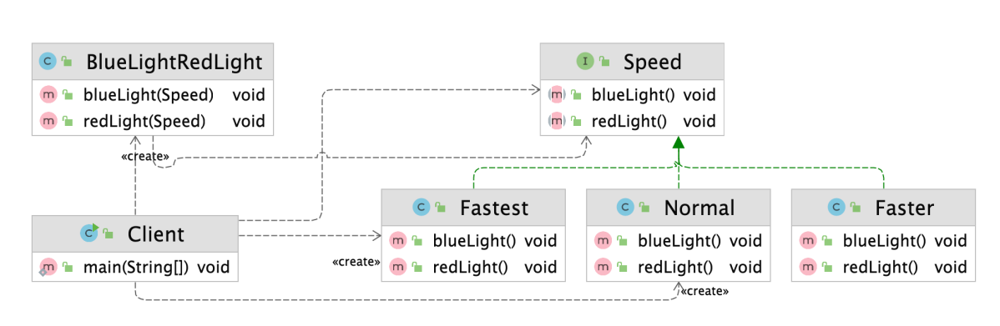

# 전략 (Strategy) 패턴
- 여러 알고리즘을 캡슐화하고 상호 교환 가능하게 만드는 패턴.
- 컨텍스트에서 사용할 알고리즘을 클라이언트가 선택한다


# Before
```kotlin
class BlueLightRedLight(
    val speed: Int
) {
    fun blueLight() {
        if ( speed == 1) {
            println("무   궁   화   꽃   이")
        } else if (speed == 2) {
            println("무 궁 화 꽃 이")
        } else {
            println("무궁화꽃이")
        }

    }

    fun redLight() {
        if (speed == 1) {
            println("피  었  습  니  다")
        }
        else if (speed == 2) {
            println("피 었 습 니 다")
        } else {
            println("피어씀다")
        }
    }
}
```
- `BlueLightRedLight`에 speed에 따라서 실행 되어야 하는 알고리즘이 바뀌게 된다
- 신규 speed 가 추가되는 경우 BlueLightRedLight 에 코드는 변경이 필요하게 된다
- OCP, SRP 을 지키지 못해서, 객체지향 원칙을 지키지 못 한다

# After
```kotlin
class BlueLightRedLight(
    val speed: SpeedStrategy,
) {
    fun blueLight() {
        speed.blueLight()
    }

    fun redLight() {
        speed.redLight()
    }
}
```
- 전략 패턴을 적용했을 때 BlueLightRedLight 는 Context에 해당하고, Speed는 Strategy에 Concrete에 해당 한다.

```kotlin
interface SpeedStrategy {
    fun blueLight()

    fun redLight()
}

class Normal: SpeedStrategy {
    override fun blueLight() {
        println("무 궁 화 꽃 이")
    }

    override fun redLight() {
        println("피 었 습 니 다")
    }
}

class Faster: SpeedStrategy {
    override fun blueLight() {
        println("무궁화꽃이")
    }

    override fun redLight() {
        println("피어씀다")
    }
}
```
- 동작되어야 할 operation을 정의한 strategy interface를 정의하고 before 예제에 있던 분기 로직을 class로 분리한다
- 각 class에서는 하나의 알고리즘을 처리하기 때문에 신규 알고리즘이 추가되거나, 해당 알고리즘이 수정되었을 때 다른 코드에 영향을 주지 않는다



# 장점 과 단점
## 장점
- 새로운 전략을 추가하더라도 기존 코드를 변경하지 않는다.
- 상속 대신 위임을 사용할 수 있다.
- 런타임에 전략을 결정할 수 있다.

## 단점
- 클래스가 많아지고, 복잡도가 증가한다
- 클라이언트 코드가 구체적인 전략을 알아야 한다.
  - 런타임에 전략이 결정되는 경우 클라이언트가 어떤 전략을 실행 시킬지 조건을 알아야 한다

# StrategyInJava
```kotlin
fun main() {
    val numbers = listOf<Int>(10, 5)
    println(numbers)
    Collections.sort(numbers, object : Comparator<Int> {
        override fun compare(o1: Int, o2: Int): Int {
            return o1 - o2
        }
    })
    println(numbers)
}
```

- interface로 구현되어서 해당 interface를 상속 받고 서로 다른 알고리즘으로 구현되어 있으면 전략패턴 중 하나

# 과제
