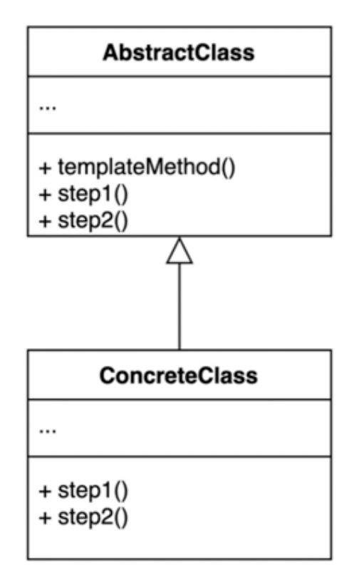
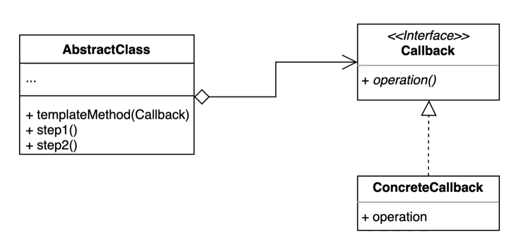

# Template method 패턴
- 알고리즘 구조를 서브 클래스가 확장할 수 있도록 템플릿으로 제공하는 패턴
- 추상 클래스는 템플릿을 제공하고 하위 클래스는 구체적인 알고리즘을 제공

- 


# Before
```kotlin
fun main( ) {
    val fileProcessor = FileProcessor("number.txt");
    val result = fileProcessor.process();
    println(result);
}
```

```kotlin
class FileProcessor(
    private val path: String
) {

    fun process(): Int {
        val lines = File(path).bufferedReader().readLine()
        try {
            val reader = File(path).bufferedReader()
            var result = 0
            var line: String? = reader.readLine()

            while (line != null) {
                result += line.toInt()
                line = reader.readLine()
            }

            return result
        } catch (e: IOException) {
            throw java.lang.IllegalArgumentException(path + "에 해당한느 파일이 없습니다.", e)
        }
    }
}
```

```kotlin
class MultiplyFileProcessor(
    private val path: String
) {

    fun process(): Int {
        val lines = File(path).bufferedReader().readLine()
        try {
            val reader = File(path).bufferedReader()
            var result = 0
            var line: String? = reader.readLine()

            while (line != null) {
                result *= line.toInt()
                line = reader.readLine()
            }

            return result
        } catch (e: IOException) {
            throw java.lang.IllegalArgumentException(path + "에 해당한느 파일이 없습니다.", e)
        }
    }
}
```

- 중복된 코드가 너무 많음
- 이런식으로 설계가 되면 결과를 연산하는 방식이 늘어날때마다 불필요한 중복 코드가 양산됨 

# After
```kotlin
fun main( ) {
    val fileProcessor = Multiply("number.txt")
    val result = fileProcessor.process()
    println(result)
}
```

```kotlin
abstract class FileProcessor(
    private val path: String
) {

    fun process(): Int {
        val lines = File(path).bufferedReader().readLine()
        try {
            val reader = File(path).bufferedReader()
            var result = 0
            var line: String? = reader.readLine()

            while (line != null) {
                result += getResult(result, line.toInt())
                line = reader.readLine()
            }

            return result
        } catch (e: IOException) {
            throw java.lang.IllegalArgumentException(path + "에 해당한느 파일이 없습니다.", e)
        }
    }

    abstract fun getResult(result: Int, number: Int): Int
}
```
- 연산하는 부분을 추상 메소드를 빼서 하위 클래스가 구현하도록 강제

```kotlin
class Multiply(
    path: String
): FileProcessor(path) {
    override fun getResult(result: Int, number: Int): Int {
        return result * number
    }
}
```

```kotlin
class Plus(
  path: String,
): FileProcessor(path) {
  override fun getResult(result: Int, number: Int): Int {
    return result + number
  }
}
```
- 연산하는 알고리즘이 추가될때마다 `getResult` 만 구현하면됨

# Template callback 패턴
- 콜백으로 상속 대신 위임을 사용하는 템플릿 패턴
- 상속 대신 익명 내부 클래스 또는 람다 표현식을 활용할 수 있음



```kotlin
fun main() {
    val fileProcessorCallback= FileProcessorCallback("number.txt")
    fileProcessorCallback.process { re: Int, number:Int -> re + number }
}
```

```kotlin
class FileProcessorCallback(
    private val path: String
) {

    fun process(operator: Operator): Int {
        try {
            val reader = File(path).bufferedReader()
            var result = 0
            var line: String? = reader.readLine()

            while (line != null) {
                result += operator(result, line.toInt())
                line = reader.readLine()
            }

            return result
        } catch (e: IOException) {
            throw java.lang.IllegalArgumentException(path + "에 해당하는 파일이 없습니다.", e)
        }
    }
}
```

```kotlin
fun interface Operator {
    operator fun invoke(result: Int, number: Int): Int
}
```
- 매번 구현할 알고리즘 구현체를 만들 필요없이 클라이언트에서 람다로 주입할 수 있음 


# 장점 과 단점
## 장점
- 템플릿 코드를 재사용하고 중복 코드를 줄일 수 있음
- 템플릿 코드를 변경하지 않고 상속을 받아서 구체적인 알고리즘만 변경할 수 있음

## 단점
- 리스코프 치환 원칙을 위반할 수 있음
  - 리스코프 치환 원칙이란?
    - 상속 구조에서  상위 타입의 객체를 하위 타입의 객체로 치환해도 동작에 문제가 없어야함
  - final 키워드를 사용해 어느정도 보완할 수 있음
    - 그러나 템플릿 구현부에서는 막지 못해서 리스코프 치환 원칙을 위반할 가능성이 잔존함
- 알고리즘 구조가 복잡할 수록 템플릿을 유지하기 어려움

# Template method in Java
- `HttpServlet`

```kotlin
class MyHello: HttpServlet() {
  override fun doGet(req: HttpServletRequest?, resp: HttpServletResponse?) {
    super.doGet(req, resp)
  }

  override fun doPost(req: HttpServletRequest?, resp: HttpServletResponse?) {
    super.doPost(req, resp)
  }
}
```

# Template method in Spring
- `JdbcTemplate`, `RestTemplate`

```kotlin
fun main() {
    // JdbcTemplate
    val jdbcTemplate = JdbcTemplate();
    jdbcTemplate.execute("insert");

    // RestTemplate
    val restTemplate = RestTemplate();

    val headers = HttpHeaders();
    headers.setAccept(listOf(MediaType.APPLICATION_JSON));
    headers.set("X-COM-PERSIST", "NO");
    headers.set("X-COM-LOCATION", "USA");

    val entity = HttpEntity<String>(headers);
    val responseEntity = restTemplate
        .exchange("http://localhost:8080/users", HttpMethod.GET, entity, String::class.java)
}
```
