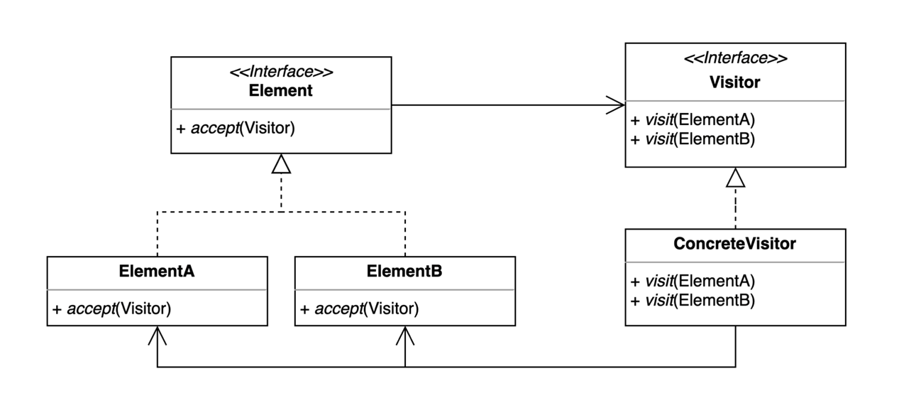

# Visitor Pattern
기존 코드를 변경하지 않고 새로운 기능을 추가하는 방법
이 강의에서는 더블디스패치를 활용하여 설명하였다. 

~~~kotlin

object Client {
    @JvmStatic
    fun main(args: Array<String>) {
        val rectangle: Shape = Rectangle()
        val device: Device = Phone()
        rectangle.printTo(device)
    }
}

class Rectangle : Shape {
    override fun printTo(device: Device) {
        if (device is Phone) {
            println("print Rectangle to phone")
        } else if (device is Watch) {
            println("print Rectangle to watch")
        }
    }
}

class Phone : Device
~~~
위 코드는 device마다 각 도형에 대해 다른 메세지를 출력하고 싶은 니즈가 있는 것이다. 
그러나 device가 추가되면 각 도형마다 수정이 필요하다. 

~~~Kotlin
object Client {
    @JvmStatic
    fun main(args: Array<String>) {
        val rectangle: Shape = Rectangle()
        val device: Device = Phone()
        rectangle.accept(device)
    }
}

class Rectangle : Shape {
    override fun accept(device: Device) {
        device.print(this)
    }
}

class Phone : Device {
    override fun print(circle: Circle) {
        println("Print Circle to Phone")
    }

    override fun print(rectangle: Rectangle) {
        println("Print Rectangle to Phone")
    }

    override fun print(triangle: Triangle) {
        println("Print Triangle to Phone")
    }
}
~~~
device가 추가되면 각 도형에 대한 출력을 적어주기만 하면 된다. 

장점
- 기존 코드를 변경하지 않고 새로운 코드를 추가할 수 있다.
- 추가 기능을 한 곳에 모아둘 수 있다.
단점 
- 복잡하다.
- 새로운 Element를 추가하거나 제거할 때 모든 Visitor 코드를 변경해야 한다.
